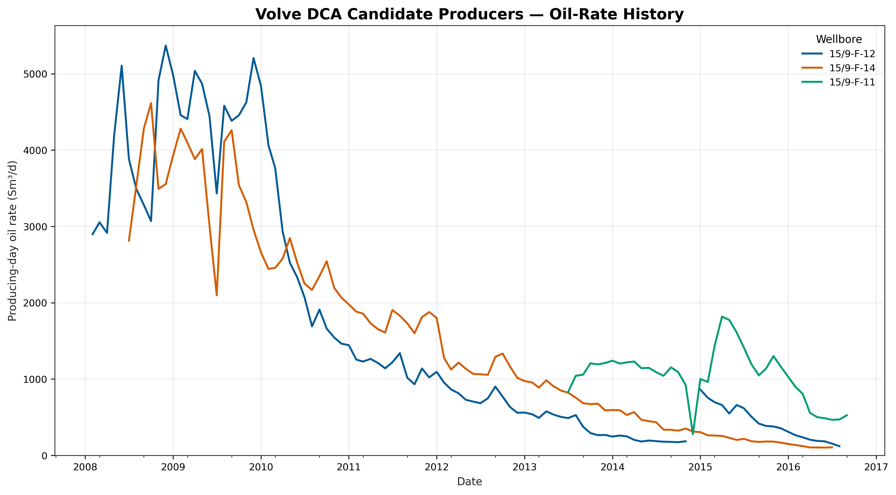
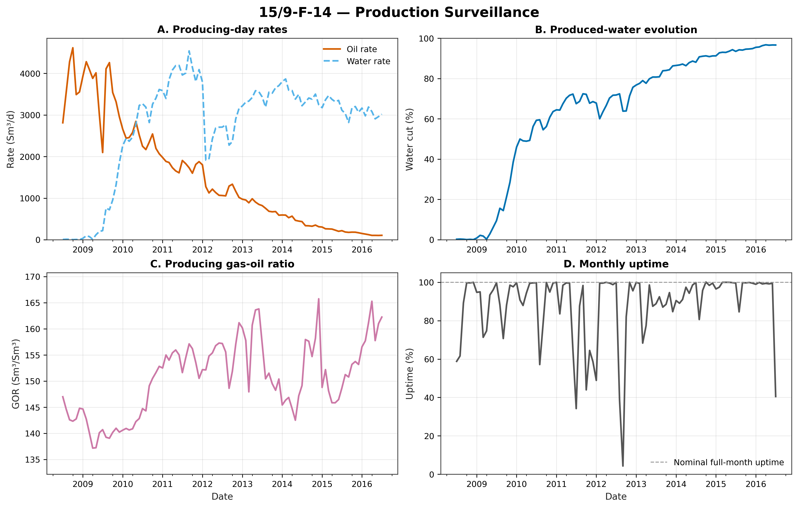

# Project 01 - Decline Curve Analysis and Production Forecasting

## Objective

Evaluate historical well production performance and develop a technically defensible production forecast using decline curve analysis.

## Engineering Questions

- How has the well's oil, gas, and water production changed with time?
- Which changes represent reservoir decline and which may result from operating conditions?
- What historical period is appropriate for decline curve fitting?
- Which Arps decline model best represents the observed production behavior?
- What production forecast does the selected model predict?
- What are the major uncertainties and limitations of the forecast?

## Methods

The project will evaluate:

- Production data quality
- Oil, gas, and water rate behavior
- Water cut
- Gas-oil ratio
- Cumulative production
- Exponential decline
- Hyperbolic decline
- Harmonic decline
- Production forecasting
- Estimated ultimate recovery
- Forecast uncertainty

## Dataset

The final analysis will use publicly available production data from the Volve field on the Norwegian Continental Shelf.

## Tools

Python | pandas | NumPy | SciPy | Matplotlib | Git

## Production Surveillance

Production histories were evaluated using producing-day oil and water rates, water cut, gas-oil ratio, and monthly uptime.

### Candidate Producer Comparison

Among the evaluated producers, `15/9-F-14` provides the longest sustained post-peak decline behavior with relatively consistent production trends.

### 15/9-F-14 Production Surveillance

The `15/9-F-14` history shows a progressive decline in oil rate accompanied by increasing water cut. Operational uptime variations are considered when selecting the decline-curve fitting interval.

Additional surveillance results for `15/9-F-12` and `15/9-F-11` are available in the `figures` directory.
