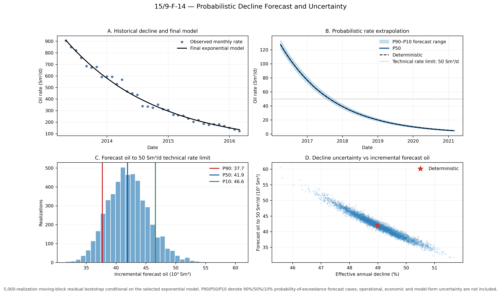
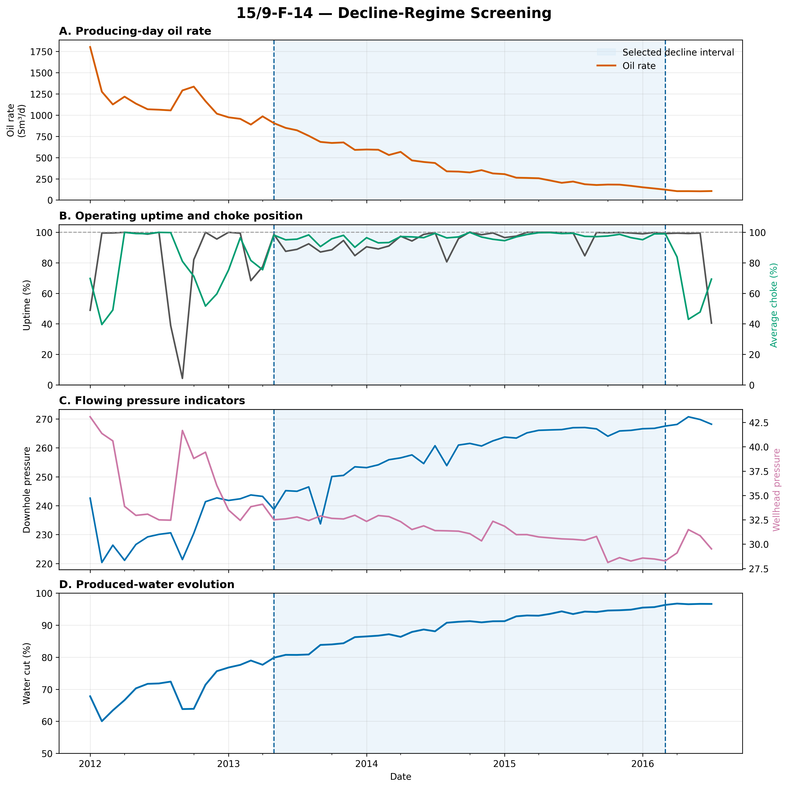
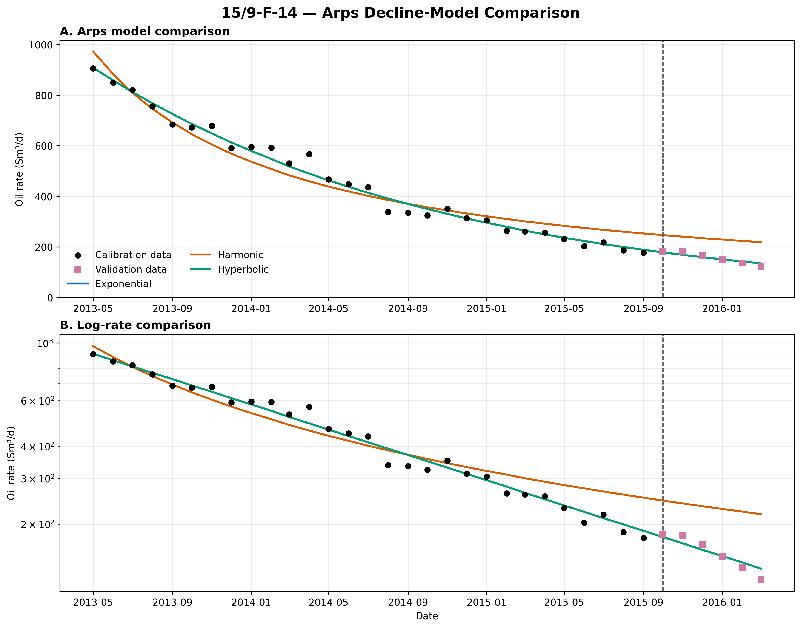
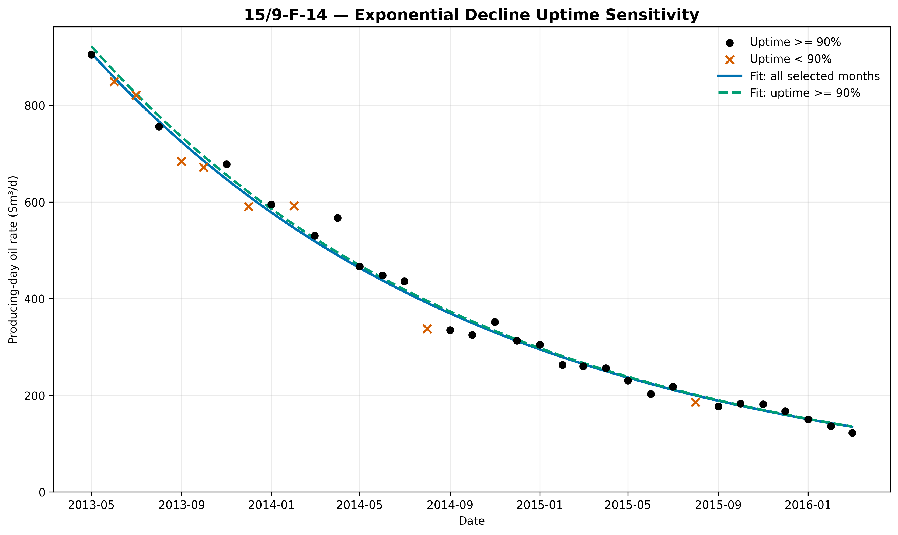
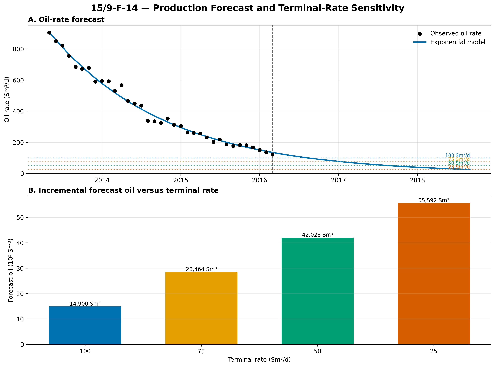

# Project 01 - Decline Curve Analysis and Production Forecasting

## Objective

Evaluate historical well production performance and develop a technically defensible production forecast using decline curve analysis.

## Engineering Questions

- How has the well's oil, gas, and water production changed with time?
- Which changes represent reservoir decline and which may result from operating conditions?
- What historical period is appropriate for decline curve fitting?
- Which Arps decline model best represents the observed production behavior?
- What production forecast does the selected model predict?
- What are the major uncertainties and limitations of the forecast?

## Methods

The project will evaluate:

- Production data quality
- Oil, gas, and water rate behavior
- Water cut
- Gas-oil ratio
- Cumulative production
- Exponential decline
- Hyperbolic decline
- Harmonic decline
- Production forecasting
- Estimated ultimate recovery
- Forecast uncertainty

## Probabilistic Decline Forecast and Uncertainty

The deterministic decline forecast provides a single production trajectory, but the fitted decline parameters are uncertain because the observed monthly rates do not lie exactly on the fitted trend. The final F-14 decline model was therefore extended with a residual-bootstrap workflow to propagate calibration uncertainty into future production rate, forecast duration, and incremental oil production.

The purpose of this analysis is **not** to construct a formal probabilistic reserves estimate. It quantifies uncertainty that can be inferred from the observed scatter around the selected exponential decline model while holding the decline-model form and future operating assumptions unchanged.

### Selected decline model

Following decline-regime screening and chronological comparison of Arps decline models, the selected F-14 decline interval is represented by the exponential relationship

$$
q(t)=q_i e^{-Dt}
$$

where:

- $q(t)$ is the oil rate at elapsed time $t$, in Sm³/d;
- $q_i$ is the fitted initial oil rate, in Sm³/d;
- $D$ is the nominal exponential decline constant, in month$^{-1}$;
- $t$ is elapsed time, in months.

For the selected 35-month decline interval,

$$
q_i = 908.07\ \text{Sm}^3/\text{d}
$$

and

$$
D = 0.05610\ \text{month}^{-1}.
$$

The corresponding effective annual decline is

$$
D_{\mathrm{eff,annual}} = 1-e^{-12D},
$$

which gives

$$
D_{\mathrm{eff,annual}} \approx 48.99\%.
$$

### Residual-bootstrap methodology

For each historical observation, the deterministic model prediction is

$$
\hat q(t_i) = \hat q_i e^{-\hat D t_i}.
$$

The model residual is defined as

$$
\varepsilon_i = q_{\mathrm{obs},i} - \hat q(t_i).
$$

A **5,000-realization moving-block residual bootstrap** is used to propagate the observed calibration scatter. Residuals are centred and resampled in three-month blocks so that short-range temporal structure is retained rather than treating every monthly residual as completely independent.

For each bootstrap realization, a synthetic production history is generated as

$$
q_i^{*} = \hat q(t_i) + \varepsilon_i^{*},
$$

where $\varepsilon_i^{*}$ is a resampled residual.

The exponential model is then refitted to the synthetic history to obtain a new parameter pair

$$
\left(q_i^{*},D^{*}\right).
$$

All 5,000 realizations produced physically admissible positive model parameters and were retained.

The fitted bootstrap parameters are not independent. Their correlation is approximately

$$
\rho(q_i,D)=0.726.
$$

This positive correlation indicates that realizations with a higher fitted initial rate generally require a correspondingly higher decline rate to remain consistent with the historical decline trend. Retaining this relationship is one reason for refitting each bootstrap realization rather than perturbing $q_i$ and $D$ independently.

### Forecast to a technical rate limit

For a specified technical rate limit $q_{\mathrm{lim}}$, the exponential model reaches the limit at

$$
t_{\mathrm{lim}} = \frac{\ln(q_i/q_{\mathrm{lim}})}{D}.
$$

If the forecast begins at elapsed time $t_s$, the remaining forecast duration is

$$
\Delta t_{\mathrm{forecast}} = t_{\mathrm{lim}}-t_s.
$$

Incremental forecast oil between the forecast start and the technical rate limit is obtained by integrating the decline curve:

$$
N_{p,\mathrm{forecast}} = \bar d_m \int_{t_s}^{t_{\mathrm{lim}}} q_i e^{-Dt}\,dt,
$$

which gives

$$
N_{p,\mathrm{forecast}} = \bar d_m \frac{q_i}{D} \left( e^{-Dt_s} - e^{-Dt_{\mathrm{lim}}} \right),
$$

where

$$
\bar d_m=\frac{365.25}{12}
$$

is the average number of days per month.

The rate limits used in this study are **technical forecasting thresholds**. They are not economic limits because no oil price, operating-cost, abandonment-cost, or other economic cut-off criterion has been introduced.

### Probabilistic forecast convention: P90, P50 and P10

Forecast uncertainty is reported using the petroleum **probability-of-exceedance convention**.

For a forecast quantity $X$,

$$
P(X\ge X_{P90})=0.90,
$$

$$
P(X\ge X_{P50})=0.50,
$$

and

$$
P(X\ge X_{P10})=0.10.
$$

Therefore,

$$
P90=Q_{0.10}, \qquad P50=Q_{0.50}, \qquad P10=Q_{0.90},
$$

where $Q_p$ is the mathematical $p$-quantile of the bootstrap distribution.

For incremental forecast oil, **P90 represents the conservative low case, P50 the median case, and P10 the high case**.

These P90/P50/P10 labels refer only to the probabilistic production forecast developed in this analysis. They should not be interpreted as formal reserves classifications.

### Results at the 50 Sm³/d technical rate limit

The deterministic forecast reaches 50 Sm³/d after approximately

$$
16.68\ \text{months},
$$

with incremental forecast oil of

$$
42.03\times10^3\ \text{Sm}^3.
$$

The bootstrap results are:

| Forecast case | Forecast duration (months) | Incremental forecast oil (10³ Sm³) |
|---|---:|---:|
| P90 | 15.39 | 37.71 |
| P50 | 16.65 | 41.92 |
| P10 | 18.01 | 46.60 |

The deterministic forecast lies close to the centre of the bootstrap distribution. The probabilistic analysis therefore does not replace the deterministic forecast; it provides a quantitative range around it that reflects uncertainty in the fitted decline relationship.

### Engineering interpretation

The bootstrap results show a clear relationship between decline uncertainty and incremental forecast production.

Realizations with a higher effective annual decline reach the technical rate limit sooner and generate less incremental oil. Realizations with a lower decline rate remain above the technical threshold for longer and therefore produce a larger incremental forecast volume.

At the 50 Sm³/d technical rate limit, the resulting P90–P10 range is approximately

$$
37.7 \text{ to } 46.6 \times10^3\ \text{Sm}^3,
$$

compared with the deterministic estimate of approximately

$$
42.0\times10^3\ \text{Sm}^3.
$$

This demonstrates why a single deterministic decline forecast should not be interpreted as an exact future production outcome.

### Scope and limitations

The uncertainty quantified here is **conditional on the selected exponential decline model**.

The current analysis does not include uncertainty associated with:

- alternative decline-model forms;
- future workovers, stimulation, or other well interventions;
- changes in choke strategy or operating conditions;
- production-system or facility constraints;
- changes in reservoir pressure support;
- geological or full-field reservoir-model uncertainty;
- commodity prices, operating costs, or economic limits.

The resulting P90/P50/P10 cases should therefore be interpreted as **conditional production-forecast uncertainty**, not as a complete probabilistic reserves or field-development assessment.

## Dataset

The final analysis will use publicly available production data from the Volve field on the Norwegian Continental Shelf.

## Tools

Python | pandas | NumPy | SciPy | Matplotlib | Git

## Production Surveillance

Production histories were evaluated using producing-day oil and water rates, water cut, gas-oil ratio, and monthly uptime.

### Candidate Producer Comparison

Among the evaluated producers, `15/9-F-14` provides the longest sustained post-peak decline behavior with relatively consistent production trends.

### 15/9-F-14 Production Surveillance

The `15/9-F-14` history shows a progressive decline in oil rate accompanied by increasing water cut. Operational uptime variations are considered when selecting the decline-curve fitting interval.

Additional surveillance results for `15/9-F-12` and `15/9-F-11` are available in the `figures` directory.

## Decline Curve Analysis — 15/9-F-14

Detailed production surveillance identified `15/9-F-14` as the primary decline-analysis well.

The selected decline interval extends from **May 2013 through March 2016** and contains 35 monthly observations.

### Model Selection

Exponential, harmonic, and hyperbolic Arps models were evaluated using chronological calibration and validation.

The hyperbolic solution converged to approximately \(b=0\), while the harmonic model showed substantially poorer validation performance. The exponential model was retained.

$$
q_o(t)=908.07\,e^{-0.05610t}
$$

with \(t\) in months from May 2013.

Key model statistics:

- \(D = 0.05610\) month⁻¹
- Effective annual decline = 48.99%
- \(R^2 = 0.9893\)
- RMSE = 23.49 Sm³/d
- MAPE = 4.76%

### Uptime Sensitivity

Excluding months with uptime below 90% changes the fitted decline constant by only 0.61%.

### Production Forecast

Historical cumulative oil through March 2016 is approximately **3.9315 million Sm³**.

Terminal-rate sensitivity was evaluated for 100, 75, 50, and 25 Sm³/d. These rates are technical forecast assumptions rather than economic limits.

Detailed results are provided in [`report/DCA_RESULTS.md`](report/DCA_RESULTS.md).
