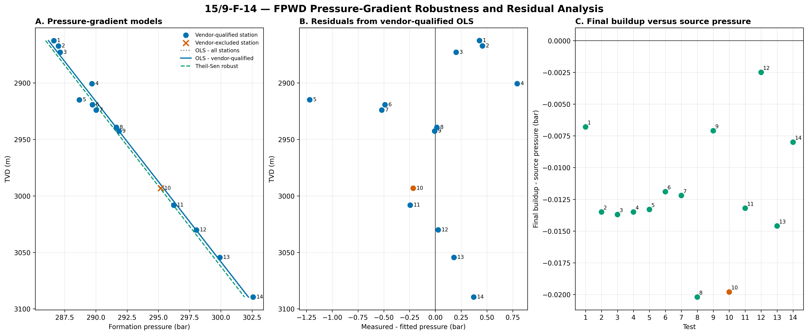
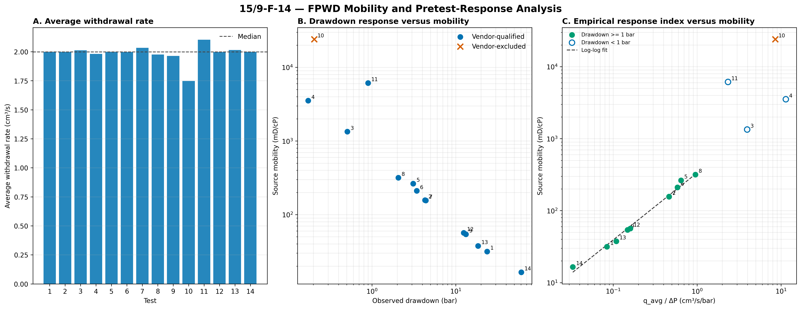
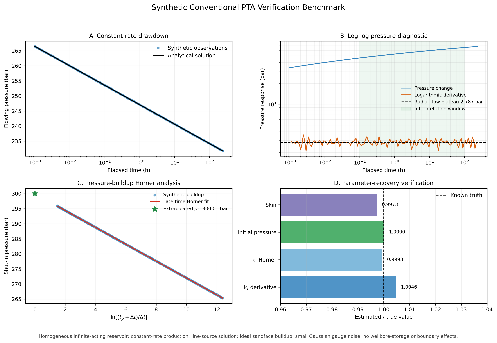

# Project 02 - Pressure Transient Analysis

## Objective

Interpret transient well-pressure behavior to identify flow regimes and estimate reservoir and near-wellbore parameters using conventional pressure-transient analysis.

## Engineering Questions

- What flow regimes are present in the pressure response?
- Is wellbore storage observable?
- Can infinite-acting radial flow be identified?
- What reservoir permeability or transmissibility is supported by the transient response?
- What skin factor is indicated by the pressure behavior?
- Are boundary effects visible within the recorded test duration?
- How sensitive are interpreted parameters to the selected analysis interval?

## Analysis Methods

The analysis will include:

- Pressure and time data quality control
- Rate-history review
- Pressure change, Δp
- Shut-in time and equivalent time where required
- Semilog pressure analysis
- Log-log pressure-change diagnostics
- Bourdet pressure derivative
- Flow-regime identification
- Wellbore-storage assessment
- Radial-flow interpretation
- Permeability or kh estimation
- Skin estimation
- Boundary-response assessment
- Parameter sensitivity

## Primary Diagnostic Relationships

Pressure change is defined as:

$$
\Delta p(t) = p_{\mathrm{reference}} - p(t)
$$

For a pressure-buildup response following shut-in:

$$
\Delta p(t) = p_{\mathrm{ws}}(t) - p_{\mathrm{wf}}
$$

where $p_{\mathrm{ws}}(t)$ is the shut-in well pressure at elapsed time $t$, and $p_{\mathrm{wf}}$ is the flowing pressure immediately before shut-in.

The logarithmic pressure derivative is:

$$
\frac{d(\Delta p)}{d\ln t}
$$

An approximately horizontal pressure-derivative response over a sustained time interval is characteristic of infinite-acting radial flow.

## Data Requirements

A suitable transient dataset must contain, at minimum:

- elapsed time or timestamp
- pressure
- test type and operating sequence
- consistent engineering units
- the imposed flow disturbance

For conventional well tests, the imposed disturbance is represented by the production or injection rate history. For formation-tester pretests, it is represented by the tool withdrawal or pretest-volume sequence.

Reservoir, fluid, and tool parameters required for quantitative interpretation are documented separately.

## Tools

Python | pandas | NumPy | SciPy | Matplotlib | Git

## Pressure Reference

The LAS interpretation parameter `pPFOR` is stored in psi. Direct psi-to-bar conversion is approximately 1.01325 bar below the formation-pressure value reported in the accompanying Schlumberger FPWD report.

The report BAR value is reproduced by:

$$
P_{\mathrm{report,bar}} = P_{\mathrm{pPFOR,psi}} \times 0.0689475729 + 1.01325
$$

The analysis therefore retains the original LAS value and applies the verified numerical reference reconciliation when comparing `pPFOR` with the quartz-gauge pressure channels expressed in bar.

## FPWD Formation-Pressure Analysis

Formation-pressure-while-drilling measurements from well `15/9-F-14` were evaluated using the quartz-gauge pressure response, source-interpreted formation pressure, drawdown mobility, test timing, and pretest withdrawal volume.

### Pressure-Depth Relationship

The formation-pressure measurements define a strong linear pressure-depth relationship. The vendor-qualified ordinary least-squares estimate gives a pressure gradient of approximately **0.07050 bar/m (7.05 bar/100 m)** with \(R^2 \approx 0.990\).

The gradient is insensitive to regression method and station screening: ordinary least squares using all stations and Theil-Sen robust regression produce closely comparable estimates.

Residual analysis is retained separately from measurement-quality classification. A pressure station may agree with the regional pressure-depth trend while still exhibit unsuitable transient behavior for formation-pressure interpretation.

### Pretest Response and Mobility

The FPWD pretests used closely comparable withdrawal volumes and average withdrawal rates. Lower-mobility intervals generally required larger pressure drawdown, while high-mobility intervals produced small-amplitude pressure responses.

Formation mobility is defined as:

$$
\lambda = \frac{k}{\mu}
$$

where $k$ is formation permeability and $\mu$ is fluid viscosity.

An empirical pretest response index is defined as:

$$
I_{\mathrm{response}} = \frac{q_{\mathrm{avg}}}{\Delta p}
$$

where $q_{\mathrm{avg}}$ is the average pretest withdrawal rate and $\Delta p$ is the observed drawdown magnitude.

For vendor-qualified tests with drawdown amplitudes of at least 1 bar, $I_{\mathrm{response}}$ shows a strong log-log association with the source-interpreted mobility.

The empirical response index is used as a pressure-response diagnostic and is not treated as an independent permeability or mobility estimate.

### Measurement Quality

The accompanying FPWD interpretation identifies Test 10 as the non-quality pressure measurement because the very high mobility prevented sufficient pressure drawdown. It is therefore excluded from the vendor-qualified pressure-gradient interpretation but retained in diagnostic figures for comparison.

### Pressure Reference

The LAS `pPFOR` values are stored in psi, while the accompanying FPWD report presents formation pressure in bar. Comparison of the source values established a consistent numerical reference offset.

The report-referenced pressure is reproduced by:

$$
P_{\mathrm{report,bar}} = P_{\mathrm{pPFOR,psi}} \times 0.0689475729 + 1.01325
$$

The original LAS value and the reconciled pressure reference are retained separately throughout the reproducible workflow.

## Conventional PTA Verification Benchmark

The field component of this project uses Volve F-14 formation-pressure-while-drilling data to evaluate formation pressure, pressure-depth behaviour, test quality, and mobility. The locally assembled F-14 dataset does not contain a separate conventional high-frequency buildup or drawdown sequence with the supporting rate history required for a defensible conventional well-test interpretation.

A controlled synthetic benchmark is therefore used to verify the conventional pressure-transient-analysis workflow rather than treating formation-tester pretests as conventional well tests.

The benchmark addresses a specific question:

> **Can the PTA workflow recover known reservoir permeability, skin, and initial pressure from a controlled drawdown and pressure-buildup response?**

This is a **verification exercise**, not a field-data validation study. The generating model and its true parameters are known in advance, allowing calculated PTA properties to be compared directly with the reference values.

### Benchmark assumptions

The synthetic reservoir is homogeneous and isotropic and contains a single slightly compressible liquid phase. The test assumes constant-rate production followed by an ideal sandface shut-in.

The principal benchmark parameters are:

| Parameter | Reference value |
|---|---:|
| Initial reservoir pressure | 300 bar |
| Surface oil rate | 500 Sm³/d |
| Formation volume factor | 1.20 rm³/Sm³ |
| Oil viscosity | 1.00 cP |
| Permeability | 100 mD |
| Net thickness | 20 m |
| Porosity | 0.20 |
| Total compressibility | \(1.0\times10^{-9}\) Pa\(^{-1}\) |
| Wellbore radius | 0.10 m |
| Skin | 3.0 |
| Production time before shut-in | 240 h |
| Buildup duration | 72 h |

Small Gaussian pressure noise is added to avoid interpreting an unrealistically exact analytical data series.

The benchmark intentionally excludes wellbore storage, reservoir boundaries, fractures, multilayer behaviour, multiphase flow, changing fluid properties, and variable-rate production.

### Drawdown model

For constant-rate radial flow, the line-source pressure response is represented by

$$
\Delta p(t)=\frac{q_r\mu}{4\pi kh}\left[E_1(u)+2s\right]
$$

with

$$
u=\frac{\phi\mu c_t r_w^2}{4kt}
$$

where \(q_r\) is reservoir-condition volumetric rate, \(\mu\) is viscosity, \(k\) is permeability, \(h\) is net thickness, \(\phi\) is porosity, \(c_t\) is total compressibility, \(r_w\) is wellbore radius, \(s\) is skin, and \(E_1\) is the exponential-integral function.

The flowing pressure is

$$
p_{wf}(t)=p_i-\Delta p(t)
$$

where \(p_i\) is initial reservoir pressure.

### Log-log pressure diagnostic

The drawdown pressure change is evaluated together with its logarithmic derivative

$$
p'=\frac{d\Delta p}{d\ln t}.
$$

For infinite-acting radial flow, the derivative approaches a constant plateau:

$$
p'_{\mathrm{radial}}=\frac{q_r\mu}{4\pi kh}.
$$

Therefore,

$$
k=\frac{q_r\mu}{4\pi h\,p'_{\mathrm{radial}}}.
$$

The theoretical derivative plateau for the benchmark is approximately

$$
2.7997\ \text{bar},
$$

while the three-point logarithmic derivative calculated from the noisy synthetic observations gives a median plateau of approximately

$$
2.7868\ \text{bar}
$$

within the prescribed radial-flow interpretation window.

The resulting permeability estimate is

$$
k_{\mathrm{derivative}}=100.46\ \text{mD},
$$

compared with the reference value of 100 mD.

The radial-flow interpretation interval is prescribed for this controlled verification case; it is **not an automatically detected flow regime**.

### Pressure buildup and superposition

The well is produced for \(t_p=240\) h and subsequently shut in.

For the synthetic line-source model, the buildup pressure is obtained by superposition:

$$
p_{ws}(\Delta t)=p_i-A\left[E_1(u_{t_p+\Delta t})-E_1(u_{\Delta t})\right]
$$

where

$$
A=\frac{q_r\mu}{4\pi kh}.
$$

At late time, the line-source solution approaches the Horner relationship

$$
p_{ws}\approx p_i-A\ln\left(\frac{t_p+\Delta t}{\Delta t}\right).
$$

Define the Horner ratio as

$$
H=\frac{t_p+\Delta t}{\Delta t}.
$$

A straight-line relationship is therefore expected between shut-in pressure and \(\ln H\) during the selected late-time radial-flow interval.

The magnitude of the Horner slope provides an independent estimate of permeability:

$$
k_{\mathrm{Horner}}=99.93\ \text{mD}.
$$

Extrapolation to

$$
\ln H=0
$$

or equivalently \(H=1\), gives the pressure intercept

$$
p_i=300.0066\ \text{bar},
$$

compared with the reference value of 300 bar.

The Horner straight-line regression gives

$$
R^2=0.999979.
$$

### Skin estimate

For the pre-shut-in flowing pressure at production time \(t_p\),

$$
p_i-p_{wf}(t_p)=A\left[E_1(u_{t_p})+2s\right].
$$

The skin estimate is therefore obtained from

$$
s=\frac{1}{2}\left[\frac{p_i-p_{wf}(t_p)}{A}-E_1(u_{t_p})\right].
$$

The benchmark gives

$$
s_{\mathrm{estimated}}=2.9918
$$

for a reference skin of

$$
s_{\mathrm{true}}=3.0000.
$$

### Verification results

| Quantity | Reference | PTA estimate | Error |
|---|---:|---:|---:|
| Permeability from derivative plateau | 100.000 mD | 100.462 mD | +0.462% |
| Permeability from Horner slope | 100.000 mD | 99.926 mD | -0.074% |
| Initial pressure from Horner intercept | 300.000 bar | 300.0066 bar | +0.0022% |
| Skin | 3.000 | 2.9918 | -0.272% |

The close recovery of the known reference parameters verifies the implementation of the radial-flow derivative, Horner buildup, pressure-intercept, and skin calculations under the benchmark assumptions.

### Engineering interpretation

The pressure derivative provides the clearest diagnostic of the imposed infinite-acting radial-flow regime. Its approximately horizontal plateau is controlled by \(kh\), allowing permeability to be estimated when net thickness and fluid properties are known.

The pressure-buildup analysis provides an independent permeability estimate from the late-time Horner slope and recovers the initial reservoir pressure through extrapolation. The agreement between the derivative-based and Horner-based permeability estimates provides an internal consistency check.

The positive reference skin represents additional near-wellbore pressure loss relative to an undamaged radial-flow response. Recovery of approximately \(s=2.99\) from a specified value of \(s=3.0\) confirms the implemented skin relationship for this controlled case.

### Verification versus field interpretation

The very small parameter errors obtained here should not be interpreted as expected field-data accuracy. The synthetic pressure response was generated using the same radial-flow physics assumed during interpretation, and only small measurement noise was added.

Real pressure-transient data may contain wellbore storage, changing rates, gauge drift, multiphase effects, boundaries, fractures, layered flow, uncertain fluid properties, and operational disturbances.

The purpose of this benchmark is therefore limited but important:

**verify the PTA implementation before applying the workflow to a real conventional well-test dataset.**

A real field application requires a suitable time-resolved pressure record together with the associated production and shut-in history.
