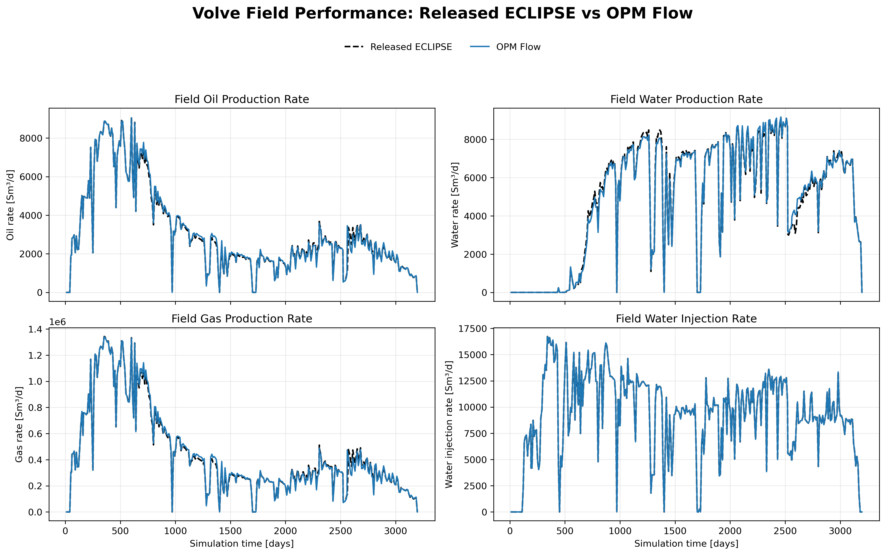
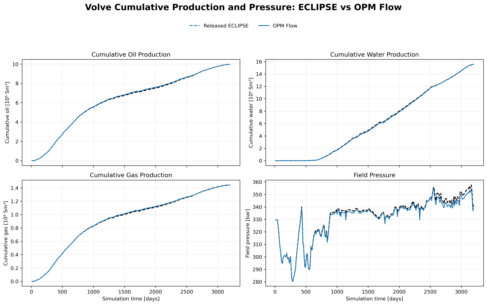
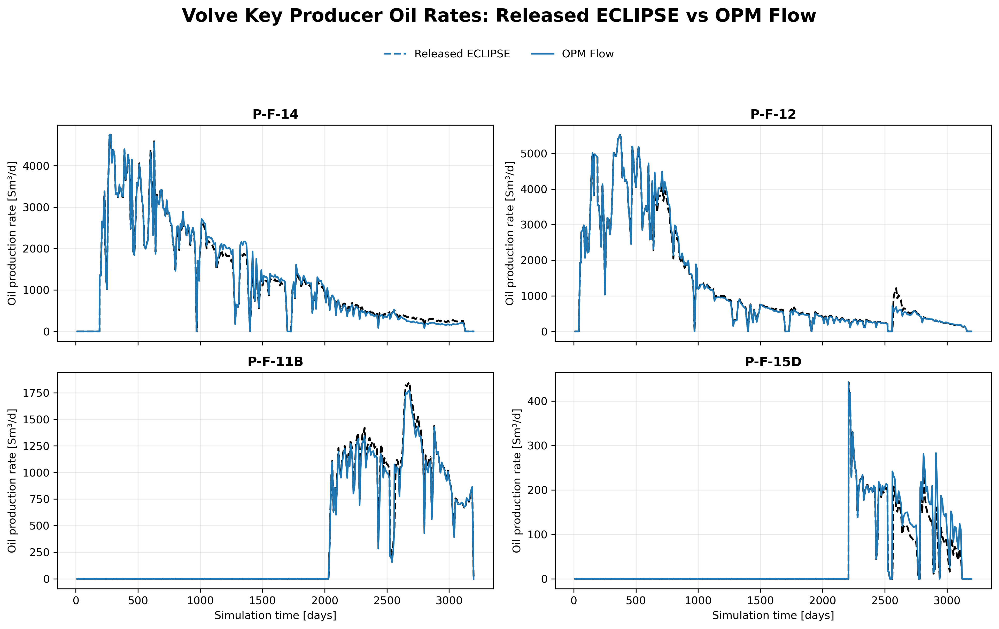
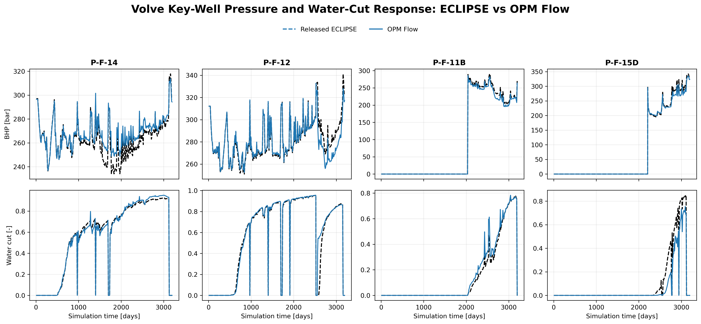
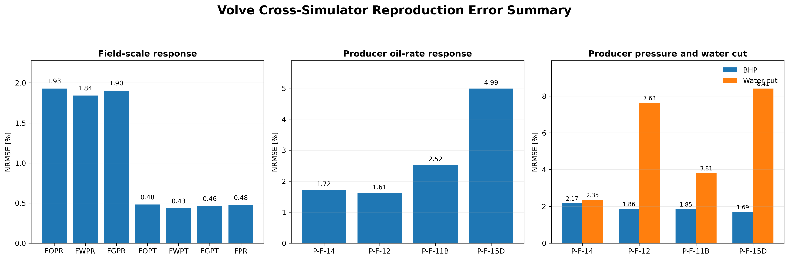
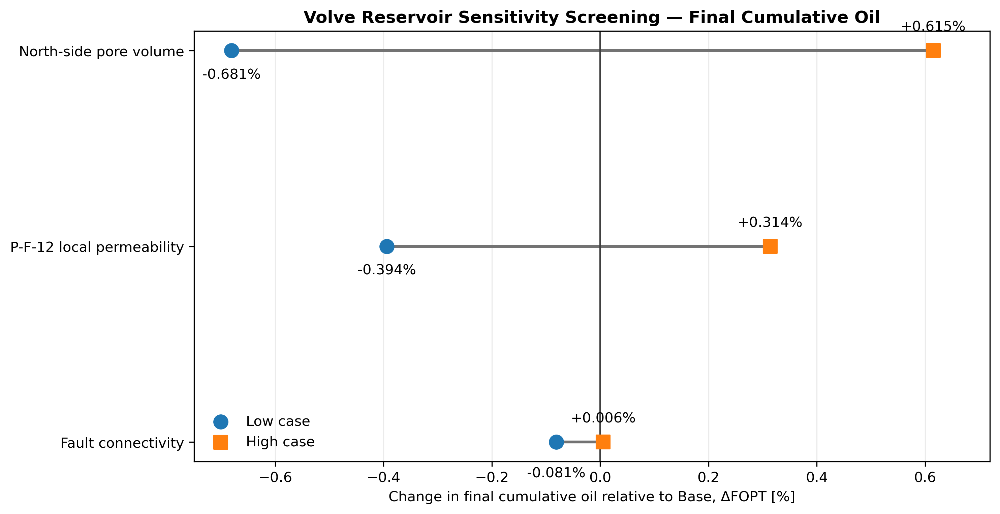
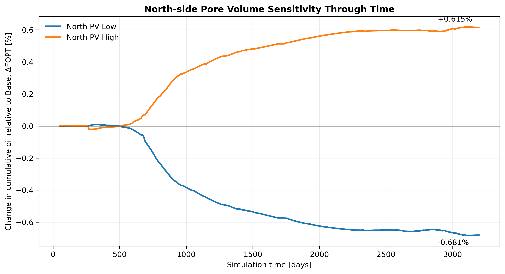

# Volve Reservoir Simulation Reproduction and Sensitivity Analysis

## Overview

This project investigates cross-simulator reproduction of the publicly released Volve reservoir simulation model using **OPM Flow**, followed by controlled reservoir-sensitivity analysis.

The released model was originally prepared for ECLIPSE and already contains its geological description, fluid model, well schedule, and associated calibration/history-matching work. The objective here was therefore **not to perform a new history match**.

The work instead focused on:

1. auditing the released simulation deck;
2. adapting the model for execution with OPM Flow;
3. reproducing the released ECLIPSE field and well response;
4. quantifying cross-simulator differences;
5. screening selected reservoir uncertainties; and
6. interpreting the resulting production, pressure, and well-control behaviour.

The comparison uses **339 aligned report times** from simulation day 11 to day 3197.

---

## Engineering workflow

Released ECLIPSE model  
→ deck and region-consistency audit  
→ OPM compatibility adaptation  
→ full OPM Flow simulation  
→ aligned summary extraction  
→ field-scale comparison  
→ well-scale comparison  
→ quantitative error analysis  
→ deterministic sensitivity screening  
→ reservoir-engineering interpretation

The model uses the `METRIC` unit system. Public figures therefore report liquid rates in Sm³/d and pressure in bar.

---

## Model provenance and compatibility

The released model required several compatibility checks before execution in OPM Flow.

The main issues addressed were:

- ROCK-region record consistency;
- RSVD/equilibrium-region consistency;
- malformed `WCONHIST` schedule syntax;
- ECLIPSE-specific or incompletely supported keywords;
- reduced parser strictness for the OPM Flow run.

`ADDZCORN` was retained as an important compatibility limitation because geometry-related operations are not guaranteed to have identical semantics between simulators.

For this reason, the results are described as **cross-simulator reproduction**, not exact simulator equivalence.

Detailed notes are available in:

- [Model provenance](docs/model_provenance.md)
- [OPM compatibility audit](docs/compatibility_audit.md)
- [Assumptions and limitations](docs/assumptions_and_limitations.md)

---

# Cross-Simulator Reproduction

## Field production rates

The OPM Flow model reproduces the major temporal behaviour of the released ECLIPSE field response, including changes associated with production scheduling, injection, well-control transitions, and shut-in periods.

The normalized RMSE values for the principal field rates were:

| Quantity | NRMSE |
|---|---:|
| FOPR | 1.93% |
| FWPR | 1.84% |
| FGPR | 1.90% |

The field-rate comparison therefore shows close agreement at the field scale while still preserving small simulator-dependent differences.

---

## Cumulative production and field pressure

Long-term cumulative quantities and field pressure show even closer agreement than the instantaneous production rates.

| Quantity | NRMSE |
|---|---:|
| FOPT | 0.48% |
| FWPT | 0.43% |
| FGPT | 0.46% |
| FPR | 0.48% |

This distinction is important. Small differences in instantaneous rates do not necessarily accumulate into large differences in total material production or reservoir-pressure evolution.

---

## Well-scale oil-production response

Field-level agreement is necessary but not sufficient. Individual wells provide a stricter test because they respond to local transmissibility, saturation, completion behaviour, pressure, and control changes.

Producer oil-rate NRMSE values were:

| Well | WOPR NRMSE |
|---|---:|
| P-F-14 | 1.72% |
| P-F-12 | 1.61% |
| P-F-11B | 2.52% |
| P-F-15D | 4.99% |

The increase in error from aggregated field response to some individual wells illustrates an important scale effect: field totals can smooth local simulator differences that remain visible at well level.

---

## Bottom-hole pressure and water cut

Bottom-hole pressure remained comparatively close between the simulators, with NRMSE values of approximately 1.69–2.17% across the four selected producers.

Water cut showed larger local differences, with NRMSE values ranging from approximately 2.35% to 8.41%.

This behaviour is physically reasonable because water cut is highly sensitive to local saturation evolution and water-front timing. Small differences in saturation propagation can therefore produce larger relative differences in water cut than in field pressure or cumulative production.

---

## Quantitative reproduction summary

The comparison shows a clear hierarchy of agreement:

**field cumulative response and pressure**
→ strongest agreement

**field rates**
→ small additional differences

**individual-well rates and pressure**
→ stronger local sensitivity

**water cut**
→ largest local simulator sensitivity

This does not imply failure of the field reproduction. It demonstrates why reservoir-model comparison should include both aggregated and local quantities rather than relying on a single production curve.

---

# Reservoir Sensitivity Analysis

Three deterministic Low/Base/High sensitivity families were investigated:

| Sensitivity | Low | Base | High |
|---|---:|---:|---:|
| Fault connectivity multiplier | 0.02 | 0.06 | 0.18 |
| P-F-12 local permeability multiplier | 0.15 | 0.30 | 0.60 |
| North-side pore-volume multiplier | 1.00 | 1.30 | 1.60 |

These cases are controlled engineering screening scenarios and are not probabilistic P10/P50/P90 realizations.

Detailed case definitions are provided in [Reservoir Sensitivity Design](docs/sensitivity_design.md).

---

## Final cumulative-oil sensitivity

The final FOPT response relative to Base was:

| Sensitivity | Low vs Base | High vs Base |
|---|---:|---:|
| North-side pore volume | -0.681% | +0.615% |
| P-F-12 local permeability | -0.394% | +0.314% |
| Fault connectivity | -0.081% | +0.006% |

Within the parameter ranges investigated, the north-side pore-volume sensitivity produced the largest final cumulative-oil response, followed by the local permeability sensitivity around P-F-12.

The selected fault-connectivity perturbation produced comparatively little change in final cumulative oil.

This ranking is **range-dependent** and should not be generalized beyond the perturbations used in this study.

---

## Development of pore-volume sensitivity through time

The pore-volume response is small during the early production period and develops progressively through the production history.

The High pore-volume case ultimately reaches approximately +0.615% FOPT relative to Base, while the Low case reaches approximately -0.681%.

This demonstrates why an end-point sensitivity plot and a time-dependent response provide complementary information:

- the end-point plot shows the final magnitude;
- the time series shows when the uncertainty begins to influence reservoir performance.

---

## P-F-12 permeability and well-control interaction

The P-F-12 permeability cases provide an important example of the interaction between reservoir properties and well controls.

Peak P-F-12 oil rate remained close to 5,520 Sm³/d across the sensitivity cases, while minimum BHP changed substantially.

The Base case reached a minimum BHP of approximately 252.5 bar, whereas the low-permeability case reached approximately 204.6 bar.

For a rate-constrained producer, lower permeability does not necessarily produce an immediate proportional decrease in production rate. Instead, the simulator may require a larger pressure drawdown to maintain the scheduled rate.

Conceptually:

q ∝ k × ΔP

Therefore, when permeability decreases while a similar rate is maintained:

k decreases → required pressure drawdown increases → producing BHP decreases.

This is an important example of why reservoir-property sensitivities should always be interpreted together with operating constraints.

---

## Fault-connectivity response

The selected fault sensitivity produced only a small final FOPT change over the tested range.

However, its pressure response was more noticeable than its cumulative-oil response.

This indicates that a structural connection can influence pressure communication without necessarily producing a large change in final field oil recovery under the existing development strategy.

The result should be interpreted specifically for the selected fault and transmissibility range rather than as a general statement about fault importance.

---

# Main Engineering Conclusions

The OPM Flow implementation reproduced the dominant behaviour of the released ECLIPSE Volve model across the full production history.

Field cumulative production and pressure showed the closest agreement, with NRMSE below approximately 0.5%, while the principal field production rates remained around 2%.

Individual-well quantities provided a stricter comparison. Oil-rate and BHP agreement remained generally close, while water cut showed greater sensitivity to local saturation-front evolution.

The sensitivity study demonstrated that geological and reservoir-property changes influence the model through different mechanisms. Within the tested ranges, north-side pore volume generated the largest final FOPT response, local permeability around P-F-12 produced an intermediate field-scale response together with a strong drawdown effect, and the selected fault-connectivity perturbation produced little final cumulative-oil change.

The results also demonstrate that sensitivity ranking cannot be interpreted independently of parameter range, development strategy, and well controls.

---

# Technical Learning

Several reservoir-engineering lessons emerged from the study.

**Simulator compatibility is an engineering problem, not only a software problem.**  
A model that successfully starts or completes in another simulator is not automatically equivalent. Keyword interpretation, geometry operations, schedule handling, and numerical controls must be audited.

**Field totals can hide local differences.**  
Strong field-scale agreement does not guarantee identical individual-well behaviour.

**Rate and cumulative production answer different questions.**  
Instantaneous discrepancies may remain small enough that long-term cumulative material movement is still reproduced very closely.

**Saturation-dependent responses are locally sensitive.**  
Water cut can amplify relatively small differences in front propagation and local saturation history.

**Well controls can mask property changes in the rate response.**  
Under rate constraints, a permeability reduction may appear primarily as increased pressure drawdown rather than as an immediate rate decrease.

**Sensitivity rankings require physical context.**  
A tornado-style ranking alone is not sufficient; perturbation range, timing, pressure response, operating constraints, and spatial definition must also be considered.

**Reproduction and history matching are different tasks.**  
This project reproduced and extended an already calibrated released model. It did not create the original Volve history match.

---

# Reproducibility

The public package contains compact derived datasets and analysis scripts rather than the very large simulator output directories.

Key scripts:

- `scripts/build_public_figures.py` — recreates Figures 01–07 directly from the compact CSV datasets included in this repository.
- `scripts/extract_sensitivity.py` — post-processes completed OPM sensitivity runs when the full simulator result directories are available. The simulation working directory is supplied as a command-line argument.

To reproduce the public figures, install the packages listed in `requirements.txt` and run `python3 scripts/build_public_figures.py`.

To repeat sensitivity extraction from full OPM outputs, run `python3 scripts/extract_sensitivity.py /path/to/Project_03_Reservoir_Simulation`.

Key result files are available in `results/`, including:

- field comparison time series;
- field and well error metrics;
- sensitivity final metrics;
- sensitivity effects relative to Base;
- P-F-12 diagnostic results;
- complete sensitivity time series.

The original large ECLIPSE/OPM grid, restart, and simulator-output files are intentionally excluded.

---

# Repository Structure

~~~text
03_volve_reservoir_simulation/
├── README.md
├── requirements.txt
├── docs/
│   ├── model_provenance.md
│   ├── compatibility_audit.md
│   ├── sensitivity_design.md
│   └── assumptions_and_limitations.md
├── figures/
│   ├── 01_volve_opm_vs_eclipse_field_rates.png
│   ├── 02_volve_opm_vs_eclipse_cumulative_pressure.png
│   ├── 03_volve_key_well_oil_rate_comparison.png
│   ├── 04_volve_key_well_bhp_watercut_comparison.png
│   ├── 05_volve_opm_vs_eclipse_error_summary.png
│   ├── 06_volve_sensitivity_final_fopt.png
│   └── 07_volve_northpv_fopt_change_vs_base.png
├── results/
│   ├── opm_vs_eclipse_field_comparison.csv
│   ├── opm_vs_eclipse_key_well_comparison.csv
│   ├── opm_vs_eclipse_field_metrics.csv
│   ├── opm_vs_eclipse_validation_summary.csv
│   ├── opm_vs_eclipse_well_oil_metrics.csv
│   ├── opm_vs_eclipse_bhp_watercut_metrics.csv
│   ├── sensitivity_final_metrics.csv
│   ├── sensitivity_effects_vs_base.csv
│   ├── sensitivity_f12_diagnostics.csv
│   └── sensitivity_timeseries_all_cases.csv
└── scripts/
    ├── extract_sensitivity.py
    └── build_public_figures.py
~~~

---

## Scope Note

This repository documents a technical cross-simulator reproduction and deterministic reservoir-sensitivity study using the publicly released Volve model.

The work should not be interpreted as:

- a new Volve history match;
- a probabilistic uncertainty study;
- independent validation of the geological model; or
- proof of exact numerical equivalence between ECLIPSE and OPM Flow.

The principal objective is to demonstrate a traceable reservoir-simulation workflow linking model audit, simulator migration, quantitative reproduction assessment, controlled sensitivity analysis, and engineering interpretation.

