# Volve Infill-Well Evaluation and Development Screening

> **Engineering question:**
> Can remaining oil in the late-life Volve reservoir support another technically attractive producer, and where should that well be placed?

---

## Project purpose

This project is an independent **early-career Petroleum Engineering study** developed to strengthen my practical understanding of how reservoir-engineering theory, realistic public field/model data, numerical simulation, and engineering judgement can be combined in a development-screening workflow.

The purpose was to move beyond classroom equations and simplified examples and practice the complete engineering reasoning chain:


```math
\text{Theory}
\rightarrow
\text{Data}
\rightarrow
\text{Reservoir surveillance}
\rightarrow
\text{Interpretation}
\rightarrow
\text{Simulation}
\rightarrow
\text{Engineering decision}
```


The objective is not to present this work as professional field-development authority or as a commercial development study.

Instead, the project documents how I approached a realistic subsurface problem as a Petroleum Engineering student: understanding the available data, asking engineering questions, applying reservoir concepts, implementing numerical workflows, checking unexpected results, and making a technically supported recommendation.

The study uses the public **Volve ECLIPSE-format black-oil reservoir model**, OPM Flow, Python, ResInsight, Linux/WSL, and extracted simulation data.

---

## Project snapshot

| Item | Description |
|---|---|
| Study | Late-life standalone infill-well technical screening |
| Model | Public Volve black-oil reservoir model |
| Simulator | OPM Flow |
| Analysis | Python + ResInsight |
| Forecast period | 1 Oct 2016 – 1 Oct 2021 |
| Forecast duration | 5 years |
| Candidate control | Producer BHP = 300 bar |
| Cases | BASE, Candidate A, Candidate B, Candidate C |
| Final ranking | **A > C >> B** |
| Preferred target | Candidate A |
| Study scope | Technical screening, not commercial sanction |

### Final five-year forecast result

| Candidate | Forecast oil | Water/Oil | Technical interpretation |
|---|---:|---:|---|
| **A** | **79.47 kSm³** | **2.77** | Preferred technical opportunity |
| **C** | **55.75 kSm³** | **3.38** | Secondary opportunity |
| **B** | **3.50 kSm³** | **104.30** | Water-dominated response; not recommended for further technical evaluation |

The numerical result is therefore:


```math
\boxed{A>C\gg B}
```


Candidate A is recommended for **further technical evaluation under the assumptions tested in this study**.

This is not a commercial drill/no-drill sanction recommendation.

---

# 1. Why this project?

My main learning objective was to understand how the concepts studied in Petroleum Engineering are connected when working with a realistic reservoir model.

Instead of asking only:

> How do I run a reservoir simulator?

I wanted to understand:

> Why should a particular simulation be run, what reservoir evidence should support it, and how should its result influence an engineering decision?

The project therefore focuses on the relationship:


```math
\boxed{
\text{Reservoir understanding}
+
\text{data interpretation}
+
\text{numerical implementation}
+
\text{QA/QC}
+
\text{engineering judgement}
}
```


A major goal was also to understand that a simulator is not a decision-maker.

The reservoir engineer must first understand the physical problem, choose useful data and assumptions, inspect whether the numerical result is reasonable, and then interpret the result within the limitations of the study.

---

# 2. Volve reservoir-model context

The project uses the late-life state of the public Volve black-oil reservoir model.

The model contains:

- a faulted three-dimensional reservoir grid;
- strong permeability heterogeneity;
- historical producer and injector wells;
- evolving pressure;
- changing oil, water, and gas saturations;
- historical water movement;
- well trajectories and completion information.

These characteristics make the model useful for practicing a realistic late-life development question.

Historical production and injection have not affected every part of the reservoir equally.

Some regions have experienced substantial pressure change and water invasion, while other areas retain meaningful oil saturation.

Existing wells have also already drained parts of the reservoir.

Therefore a potential new producer cannot be selected by simply looking for the highest remaining oil saturation.

The actual development question is more complex:

> **Where is remaining oil associated with enough pore volume, reservoir quality, pressure, favorable sweep history, and spacing from existing drainage to justify further technical evaluation?**

---

# 3. Development problem

A late-life reservoir may still contain significant oil after years of production.

However:


```math
\boxed{
\text{remaining oil}
\neq
\text{automatically producible opportunity}
}
```


A region may have high oil saturation but still be unattractive because:

- the oil-filled volume is small;
- permeability is poor;
- the area is heavily water swept;
- pressure support is weak;
- relative oil mobility is poor;
- another producer is already draining the region;
- faults reduce useful connectivity;
- the selected completion includes water-dominated layers.

The project was therefore designed as an **infill-well screening problem** rather than simply a remaining-oil mapping exercise.

---

# 4. Study objectives

The main objectives were to:

1. understand the reservoir geometry and fault framework;
2. evaluate permeability heterogeneity;
3. examine historical reservoir-pressure evolution;
4. investigate historical water-saturation change;
5. identify late-life remaining oil;
6. understand the location of existing wells and previous drainage;
7. screen out locations with insufficient spacing from existing completions or evidence of substantial historical water invasion;
8. generate technically reasonable candidate locations;
9. evaluate vertical completion intervals;
10. compare three final candidates using common forecast assumptions;
11. inspect oil rate, cumulative oil, water production, water cut, and pressure response;
12. perform independent QA/QC before accepting the numerical results;
13. rank the candidates and make a technically defensible recommendation.

---

# 5. Engineering questions

The workflow was driven by engineering questions rather than by software commands.

### Reservoir condition

**Where is oil still present?**

**Where has the reservoir been strongly water swept?**

**How has pressure changed during historical production?**

**Where is good-quality permeable rock located?**

### Remaining-oil opportunity

**Does high oil saturation correspond to meaningful oil-filled pore volume?**

**Is the remaining oil associated with sufficient permeability?**

**Has the location already experienced strong water invasion?**

**Is the target sufficiently separated from existing well completions?**

### Completion design

**Which vertical interval should be opened?**

**Are some layers more water dominated than others?**

**Can a poor layer be excluded to improve the quality of the tested completion?**

### Forecast performance

**How much oil can each candidate produce under the same screening control?**

**How quickly does the oil rate decline?**

**How much water is produced with the oil?**

**How does water cut evolve?**

**How strongly does each candidate affect reservoir pressure?**

### Decision

**Which candidate should be carried forward?**

**Which candidate should not be advanced for further technical evaluation?**

**What can and cannot be concluded from this deterministic experiment?**

---

# 6. Reservoir-engineering concepts used

The project applies several basic reservoir-engineering concepts directly to the Volve model.

## 6.1 Saturation balance

For an oil-water-gas system:


```math
S_o+S_w+S_g=1
```


where:

- $S_o$ = oil saturation;
- $S_w$ = water saturation;
- $S_g$ = gas saturation.

Late-life oil saturation helps identify where oil remains.

However, a cell or small region with high $S_o$ does not necessarily contain a large development opportunity.

That leads to the next concept.

---

## 6.2 Oil-filled pore-volume screening

A useful relative screening quantity is:


```math
M_{\mathrm{oil}} = \sum_i PV_i S_{o,i}
```


where:

- $PV_i$ is pore volume in cell $i$;
- $S_{o,i}$ is oil saturation.

This is used in this project as a **relative candidate-screening metric**.

It is not presented as a formal reserve estimate or stock-tank oil calculation.

The concept is important because:


```math
\boxed{
\text{high }S_o
\text{ in a small volume}
<
\text{moderately high }S_o
\text{ across a much larger useful volume}
}
```


depending on reservoir quality and connectivity.

---

## 6.3 Darcy-flow concept

A simplified Darcy relationship is:


```math
q
\propto
\frac{kA\Delta P}{\mu L}
```


where:

- $q$ = flow rate;
- $k$ = permeability;
- $A$ = flow area;
- $\mu$ = viscosity;
- $\Delta P$ = pressure difference;
- $L$ = characteristic flow length.

This explains why a high-oil-saturation location with poor permeability can perform worse than a more permeable target.

---

## 6.4 Phase mobility

For phase $\alpha$:


```math
\lambda_\alpha
=
\frac{k_{r,\alpha}}{\mu_\alpha}
```


where:

- $k_{r,\alpha}$ = relative permeability;
- $\mu_\alpha$ = phase viscosity.

The relative mobility of oil and water helps determine which phase preferentially flows toward the well.

This becomes particularly important in historically water-swept regions.

---

## 6.5 Water cut

Water cut is:


```math
f_w
=
\frac{q_w}{q_o+q_w}
```


where:

- $q_w$ = water production rate;
- $q_o$ = oil production rate.

A candidate can contain remaining oil and still be technically unattractive if its production is overwhelmingly water dominated.

Candidate B later provides a clear example of this.

---

## 6.6 Pressure and drawdown

A simple well-production concept is:


```math
\Delta P = P_r - P_{wf}
```


where:

- $P_r$ = reservoir pressure;
- $P_{wf}$ = flowing bottom-hole pressure.

All final candidate forecasts use the same screening control:


```math
P_{wf}=300\ \mathrm{bar}
```


Using the same BHP constraint provides a consistent basis for comparing candidate behavior.

---

## 6.7 Historical water-saturation change

Water-saturation change was used as a simple indicator of previous water invasion:


```math
\Delta S_w =
S_{w,\mathrm{late}} -
S_{w,\mathrm{initial}}
```


A strongly positive $\Delta S_w$ indicates that the region has experienced greater water invasion.

This is useful because late-life $S_o$ alone does not reveal the complete sweep history.

---

## 6.8 Integrated screening principle

The central screening principle developed in this project is:


```math
\boxed{
\text{Infill quality}
\neq
f(S_o)\text{ only}
}
```


Instead, an opportunity should be interpreted using multiple variables:


```math
\boxed{
PV,\;
S_o,\;
k,\;
P,\;
\Delta S_w,\;
k_r,\;
\text{connectivity},\;
\text{well spacing},\;
\text{completion design}
}
```


The remainder of the project tests this idea using the Volve reservoir model.

---

# 7. Model and data understanding

Before selecting any infill location, the first task was to understand what information exists in the reservoir model and what each quantity can contribute to a development decision.

The Volve model is an **ECLIPSE-format black-oil model** containing a three-dimensional grid, static reservoir properties, dynamic restart information, historical wells, completion data, and production controls.

The main information used in this project included:

- grid geometry and faults;
- porosity and pore volume;
- directional permeability;
- reservoir pressure;
- oil, water, and gas saturation;
- historical saturation change;
- well trajectories;
- well completion locations;
- OPM Flow restart data;
- ESMRY/SMSPEC summary output;
- field- and well-level forecast production variables.

The analysis therefore used both:

### Static information

Examples:


```math
k,\quad
\phi,\quad
PV,\quad
\text{fault geometry}
```


and:

### Dynamic information

Examples:


```math
P(t),\quad
S_w(t),\quad
S_o(t),\quad
q_o(t),\quad
q_w(t)
```


The purpose was to combine them rather than make a development decision from one property alone.

---

# 8. Historical well and drainage context

The historical Volve model contains an established system of wells that already influenced the reservoir before the late-life screening date.

For an infill study, this matters because a location that appears attractive on a saturation map may already lie close to an existing producer, injector, or historical completion.

The screening therefore included well trajectories and completion locations rather than considering the reservoir grid in isolation.

Several existing wells became particularly relevant during candidate screening, including:

- **P-F-10**;
- **P-F-11B**;
- **P-F-12**;
- **P-F-15C**;
- **I-F-4**.

These wells were important because some initially attractive candidate locations were found to lie too close to existing drainage or injection history.

For example, an earlier target around:


```math
(I,J)=(68,23)
```


was only approximately:


```math
1.41
```


grid-index cells from an existing P-F-10 completion.

Another initially considered location near:


```math
(I,J)=(73,31)
```


was found to be traversed by the P-F-10 trajectory.

Those targets were therefore not retained as independent infill opportunities.

This demonstrates an important well-placement principle:


```math
\boxed{
\text{Remaining oil map}
+
\text{existing well geometry}
\rightarrow
\text{more realistic candidate screening}
}
```


The spacing values used during this stage are **grid-index distances**, not physical metre-scale distances.

They were used as relative screening indicators only.

---

# 9. Reservoir surveillance

Reservoir surveillance was used to understand how the historical reservoir state developed before attempting any forecast.

The main questions were:

1. What does the structural framework look like?
2. Where is the reservoir most permeable?
3. How did pressure change?
4. Where did water invade?
5. Where does oil remain in the late-life model?

---

## 9.1 Reservoir geometry and fault framework

The first step was to inspect the three-dimensional reservoir structure.

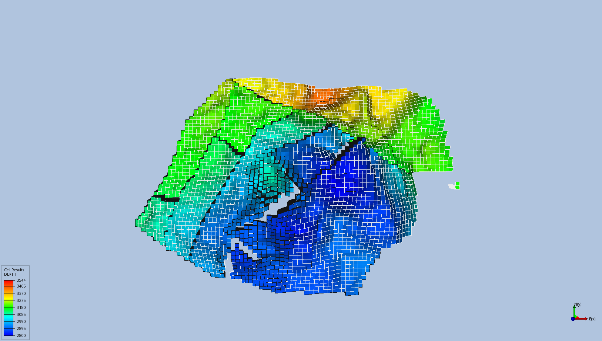

**Figure 1. Volve reservoir geometry and fault framework.**

The model contains a structurally complex and faulted reservoir.

The faults are important because they can influence:

- pressure communication;
- fluid movement;
- drainage patterns;
- sweep;
- connectivity between a candidate well and surrounding reservoir volume.

The geometry therefore provides the structural framework within which all later pressure, saturation, and well-placement results must be interpreted.

---

## 9.2 Static permeability distribution

Reservoir deliverability depends strongly on rock quality.

The permeability field was therefore examined before interpreting remaining oil.

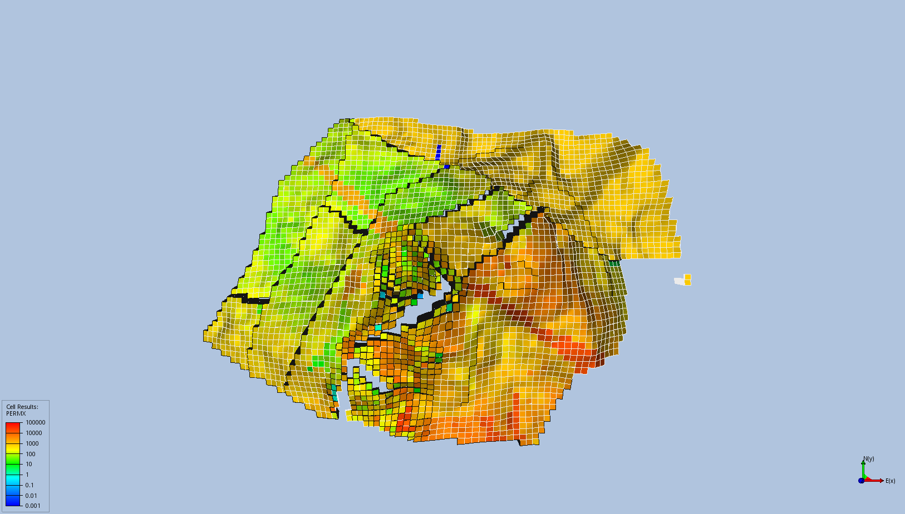

**Figure 2. Static permeability distribution in the Volve reservoir model.**

The model shows strong spatial permeability heterogeneity.

Some reservoir regions contain very high permeability, while others are much less conductive.

This matters because:


```math
q
\propto
k
```


all else being equal in the simplified Darcy relationship.

Therefore:

> A high-$S_o$ target located in poor-quality rock may be less attractive than a slightly lower-saturation target located in highly permeable rock.

This becomes important later when comparing Candidates A and C.

---

## 9.3 Historical pressure evolution

Pressure was extracted from the dynamic restart states to understand how the reservoir responded during historical production.

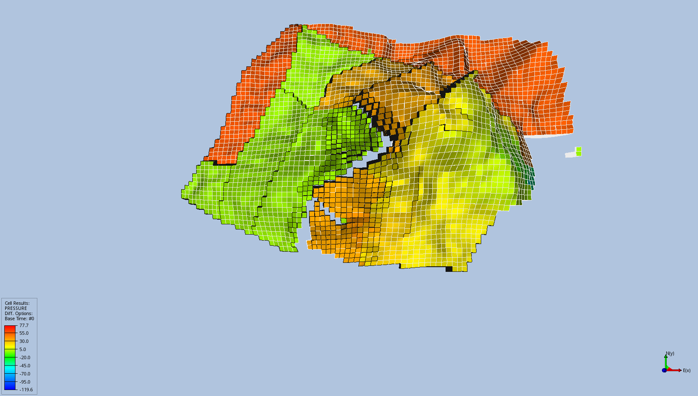

**Figure 3. Historical pressure change between the early and late reservoir states.**

The pressure response is spatially heterogeneous.

Different parts of the reservoir experienced different degrees of pressure change, reflecting the combined effects of:

- production;
- injection history;
- fluid movement;
- connectivity;
- faults;
- reservoir heterogeneity.

The pressure map was therefore treated as a dynamic surveillance indicator rather than as an isolated property.

Pressure alone was not used to choose a candidate, but it helped characterize the state of potential development regions.

---

## 9.4 Historical water sweep

Water-saturation change was used to identify regions affected by historical water invasion.

The main diagnostic was:


```math
\Delta S_w =
S_{w,\mathrm{late}} -
S_{w,\mathrm{initial}}
```


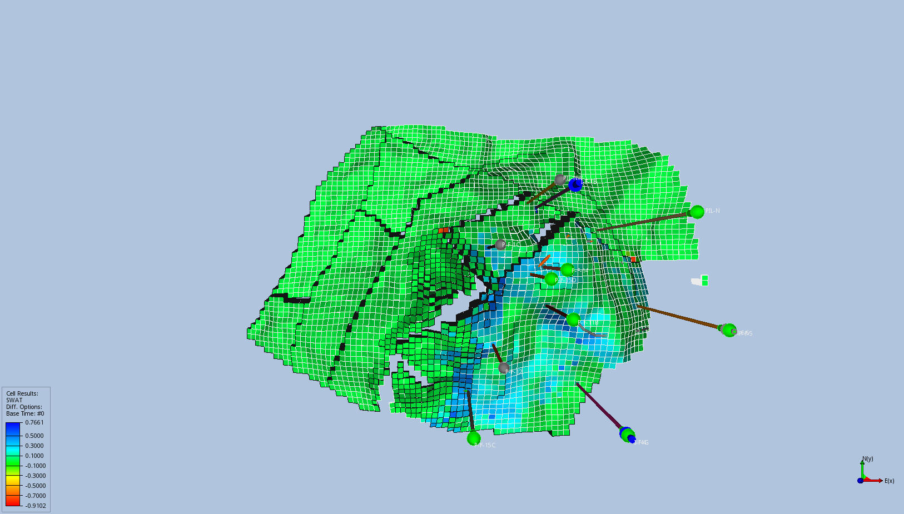

**Figure 4. Historical water-saturation change shown together with existing well trajectories.**

The figure connects dynamic sweep behavior directly with the existing well system.

Regions with large positive:


```math
\Delta S_w
```


have experienced stronger historical water invasion.

This is important because a late-life location may still contain some oil but already have poor oil mobility and high water-production risk.

Therefore the project did not treat:


```math
S_o
```


and:


```math
\Delta S_w
```


as interchangeable quantities.

They answer different engineering questions:

- $S_o$: how much oil saturation remains?
- $\Delta S_w$: how strongly has the location been invaded by water over time?

Both are useful for screening.

---

# 10. Late-life remaining-oil assessment

After understanding structure, permeability, pressure, sweep, and well locations, the next question was:

> **Where does meaningful oil remain in the late-life reservoir state?**

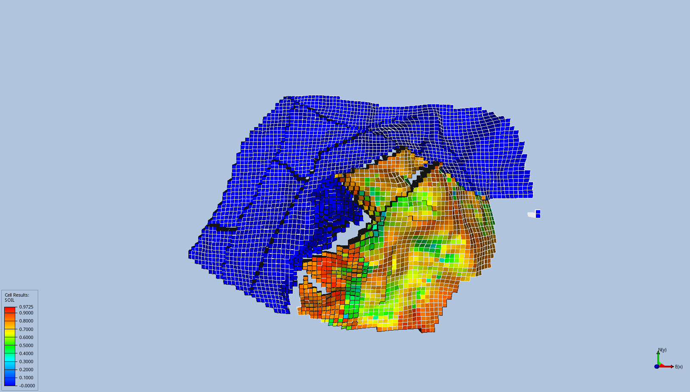

**Figure 5. Late-life oil saturation in the 2016 reservoir state.**

The map shows several regions with high remaining oil saturation.

However, this figure was intentionally **not used as a drilling-target map by itself**.

The key lesson is:


```math
\boxed{
S_o\text{ map}
\neq
\text{development decision}
}
```


A high-saturation region still needs to be checked for:

- pore volume;
- permeability;
- pressure;
- historical sweep;
- spacing relative to existing completions;
- useful completion thickness;
- connectivity.

This distinction became especially important for Candidate C, which contains very high remaining oil saturation but a smaller completion-scale oil-filled pore-volume opportunity than Candidate A.

---

# 11. Candidate generation and screening

Candidate generation was performed iteratively.

The objective was not to search for a single maximum value of one property.

Instead, candidate locations were evaluated using several screening indicators.

The primary screening factors were:


```math
\boxed{
S_o,\;
PV S_o,\;
k,\;
P,\;
\Delta S_w,\;
\text{well spacing},\;
\text{completion quality}
}
```


Several locations were evaluated and screened out before the final three candidates were selected for forecast evaluation.

---

## 11.1 Full-column screening

The broader candidate-screening stage compared properties through the available vertical reservoir column at each location.

Important examples included:

| Location | Nearest existing well/completion | Approx. grid-index spacing | Column oil-filled pore-volume screening metric | Weighted $S_o$ | Weighted $\Delta S_w$ | Median PERMX |
|---|---|---:|---:|---:|---:|---:|
| ALT_70_21 | P-F-10 / I-F-4 | 4.24 | 18,536 | 0.494 | 0.352 | 1,310 mD |
| ALT_66_32 | P-F-10 | 5.00 | 10,176 | 0.346 | 0.479 | 804 mD |
| ALT_46_27 | P-F-15C | 8.06 | 2,183 | 0.820 | approximately 0 | 329 mD |

These values already illustrate why candidate screening requires more than one variable.

### ALT_70_21

This location contains the largest screened oil-filled pore-volume opportunity among the final candidates and strong reservoir quality.

### ALT_66_32

This location retains some oil but shows substantially stronger historical water invasion.

### ALT_46_27

This location contains very high remaining oil saturation but much less total oil-filled pore-volume opportunity.

This provides an important comparison:


```math
S_{o,C}>S_{o,A}
```


does **not** automatically imply:


```math
\text{Opportunity}_C>\text{Opportunity}_A
```


because the useful reservoir volume and permeability also differ strongly.

---

## 11.2 Final candidate locations

After screening and well-spacing assessment, three candidates were selected for forecast evaluation:

### Candidate A


```math
(I,J)=(70,21)
```


Source screening location:


```math
ALT\_70\_21
```


Approximate nearest existing-completion spacing:


```math
4.24\text{ grid-index cells}
```


### Candidate B


```math
(I,J)=(66,32)
```


Source screening location:


```math
ALT\_66\_32
```


Approximate spacing:


```math
5.00\text{ grid-index cells}
```


### Candidate C


```math
(I,J)=(46,27)
```


Source screening location:


```math
ALT\_46\_27
```


Approximate spacing:


```math
8.06\text{ grid-index cells}
```


These candidates intentionally represent different reservoir conditions rather than three nearly identical opportunities.

---

## 11.3 Vertical completion design

After selecting candidate locations, the next task was to decide which vertical layers should actually be opened.

This is important because:


```math
\boxed{
\text{good location}
\neq
\text{all layers should be completed}
}
```


A completion can include both attractive oil-bearing layers and poor water-dominated layers.

The final tested completions were:

| Candidate | I | J | Final completion |
|---|---:|---:|---|
| A | 70 | 21 | **K1–4** |
| B | 66 | 32 | **K59–63** |
| C | 46 | 27 | **K59–63** |

Candidate A deserves special attention.

An earlier screening table included:


```math
K1-5
```


but K5 showed significantly greater late-life water saturation and historical water invasion.

The final forecast therefore deliberately excluded K5.

The actual forecast deck was audited and confirmed:


```math
\boxed{
\text{INF-A completion}=K1-4
}
```


This refinement demonstrates why completion design should be treated separately from candidate-location selection.

---

## 11.4 Final completion-scale comparison

After correcting the Candidate A interval to the actual tested K1–4 completion, the final completion-scale metrics were:

| Metric | Candidate A | Candidate B | Candidate C |
|---|---:|---:|---:|
| Completion | K1–4 | K59–63 | K59–63 |
| Oil-filled pore-volume screening metric | **5,085** | 2,109 | 1,472 |
| Oil-PV-weighted $S_o$ | **83.1%** | 30.7% | 81.8% |
| Oil-PV-weighted $\Delta S_w$ | **+2.3 pp** | **+46.7 pp** | approximately 0 pp |
| Median PERMX | **4,665 mD** | 136 mD | 342 mD |
| Approx. spacing | 4.24 cells | 5.00 cells | 8.06 cells |

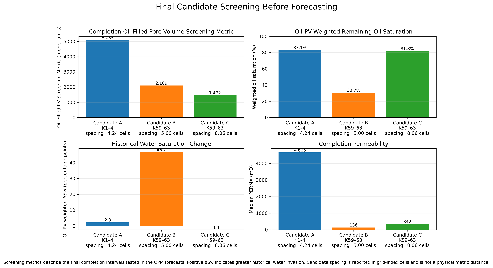

**Figure 6. Final candidate screening before forecasting.**

The comparison gives three clearly different engineering hypotheses.

---

### Candidate A — favorable development hypothesis

Candidate A combines:

- high remaining oil saturation;
- the largest completion-scale oil-filled pore-volume screening metric;
- extremely high permeability;
- comparatively limited completion-scale historical water invasion.

The pre-forecast expectation was:

> **Candidate A should provide the strongest oil productivity and the largest five-year recovery among the three tested locations.**

---

### Candidate B — elevated water-production hypothesis

Candidate B has:

- much lower remaining oil saturation;
- low completion permeability;
- the largest historical water-saturation increase.

The pre-forecast expectation was:

> **Candidate B is at high risk of producing predominantly water despite some remaining oil.**

---

### Candidate C — high-saturation, lower-volume development hypothesis

Candidate C has:

- very high remaining oil saturation;
- essentially no completion-scale historical water-saturation increase;
- moderate permeability;
- the smallest completion-scale oil-filled pore-volume screening metric.

The pre-forecast expectation was:

> **Candidate C should produce meaningful oil but may be limited by smaller connected oil-filled volume compared with Candidate A.**

---

## 11.5 Pre-forecast decision logic

Before running the final forecast simulations, the candidate logic could therefore be summarized as:


```math
\boxed{
A:
\text{large oil opportunity}
+
\text{excellent permeability}
+
\text{limited historical water invasion}
}
```


```math
\boxed{
B:
\text{substantial historical water-invasion risk}
+
\text{unfavorable oil-phase mobility and deliverability}
}
```


```math
\boxed{
C:
\text{very high }S_o
+
\text{smaller oil-filled pore-volume extent}
}
```


The purpose of the forecast stage was then to determine whether these reservoir-engineering expectations were supported by the numerical forecast response.


---

# 12. Forecast design

Following reservoir surveillance, remaining-oil assessment, existing-well spacing evaluation, and completion screening, the three selected candidates were evaluated using numerical reservoir simulation.

The forecast study was designed to address the following engineering question:

> **How do the selected candidate completions compare in oil deliverability, cumulative oil production, water-production response, and reservoir-pressure behavior when evaluated from the same late-life reservoir state under an identical well-control constraint?**

The objective was to compare the relative technical performance of the three reservoir opportunities under a controlled set of assumptions.

The study was not intended to optimize the operating strategy of each individual well.

---

## 12.1 Forecast cases

Four simulation cases were evaluated:

| Case | Description |
|---|---|
| BASE | Late-2016 reservoir state with no new infill producer |
| A | BASE reservoir state with hypothetical producer INF-A |
| B | BASE reservoir state with hypothetical producer INF-B |
| C | BASE reservoir state with hypothetical producer INF-C |

The final candidate configurations were:

| Case | Well | I | J | Completion interval |
|---|---|---:|---:|---|
| A | INF-A | 70 | 21 | K1–4 |
| B | INF-B | 66 | 32 | K59–63 |
| C | INF-C | 46 | 27 | K59–63 |

All candidate cases were derived from the same historical reservoir state.

Consequently, the comparison isolates differences associated primarily with:

- well location;
- selected completion interval;
- local reservoir properties;
- fluid-saturation distribution;
- pressure state;
- dynamic connectivity to the surrounding reservoir volume.

---

## 12.2 Forecast period

The forecast interval was:


```math
1\text{ October 2016}
\rightarrow
1\text{ October 2021}
```


corresponding to a five-year technical screening period.

A common forecast duration ensures that cumulative and rate-based performance metrics are evaluated over the same time interval.

---

## 12.3 Common well-control constraint

Each candidate producer was operated under the same flowing bottom-hole-pressure constraint:


```math
P_{wf}=300\ \mathrm{bar}
```


where $P_{wf}$ denotes flowing bottom-hole pressure.

Using the same BHP constraint provides a consistent comparison basis.

Rather than prescribing different optimized production strategies, each candidate is subjected to the same well-pressure condition and allowed to respond according to the surrounding reservoir and completion characteristics.

This controlled design supports a more direct comparison of reservoir deliverability.

---

## 12.4 Forecast operating assumptions

During the forecast period:

- historical producers remained inactive;
- historical water injectors remained inactive;
- gas injection remained inactive;
- the BASE case contained no active forecast well;
- each candidate case contained one hypothetical infill producer.

The study is therefore described as:

> **a deterministic late-life standalone infill-well technical screening study**

and not as a complete future full-field development plan.

Because the historical production system was not reactivated, the forecast does not directly quantify:

- interference with simultaneously operating historical producers;
- production redistribution between active wells;
- full-field production cannibalization;
- optimized injection support;
- facility-constrained operating strategy.

These effects would require a broader field-development study.

---

## 12.5 Controlled-comparison principle

The forecast design can be summarized as:


```math
\boxed{
\text{common reservoir state}
+
\text{common forecast duration}
+
\text{common BHP constraint}
}
```


while changing:


```math
\boxed{
\text{candidate location}
+
\text{completion interval}
}
```


The resulting differences in oil, water, and pressure response are therefore used as technical screening evidence for the three selected development alternatives.


---

# 13. Numerical implementation

The forecast study was implemented using **OPM Flow** with the public Volve ECLIPSE-format black-oil model.

The historical model was retained as the reference model, and independent forecast cases were generated for the BASE case and the three selected development alternatives.

The final forecast input decks were:

- `P04_FORECAST_BASE.DATA`
- `P04_FORECAST_A.DATA`
- `P04_FORECAST_B.DATA`
- `P04_FORECAST_C.DATA`

Maintaining separate forecast decks allowed each development alternative to be evaluated independently while preserving the same historical reservoir state.

## 13.1 Forecast-case construction

A Python workflow was used to construct the forecast cases consistently.

The workflow defined:

- candidate well name;
- grid location;
- completion interval;
- forecast schedule;
- common bottom-hole-pressure constraint;
- required field- and well-level summary quantities.

Using a common case-generation procedure reduced the possibility of introducing unintended differences between Candidates A, B, and C.


## 13.2 Candidate-well and completion definitions

The final forecast cases used the following candidate-well configurations:

| Candidate | Well | I | J | Completion interval | Control |
|---|---|---:|---:|---|---|
| A | INF-A | 70 | 21 | K1–4 | BHP = 300 bar |
| B | INF-B | 66 | 32 | K59–63 | BHP = 300 bar |
| C | INF-C | 46 | 27 | K59–63 | BHP = 300 bar |

The actual Candidate A forecast deck was independently checked and confirmed to contain the completion interval:


```math
\boxed{K1-4}
```


This verification was important because an earlier intermediate summary table still contained the superseded K1–5 screening interval.

The final numerical results reported in this project therefore correspond to the verified K1–4 Candidate A completion.

Candidates B and C were evaluated using K59–63.

All three candidates were operated with the same flowing bottom-hole-pressure constraint:


```math
\boxed{P_{wf}=300\ \mathrm{bar}}
```


Using identical well-control conditions provides a consistent basis for comparing the reservoir and completion response of the three development alternatives.


## 13.3 Summary quantities and result processing

The forecast evaluation was based on field- and well-level summary quantities extracted from the OPM Flow simulation output.

The principal field-level quantities were:

| Variable | Engineering quantity | Use in this study |
|---|---|---|
| `FOPT` | Field cumulative oil production | Five-year oil-production comparison |
| `FWPT` | Field cumulative water production | Cumulative water-production assessment |
| `FOPR` | Field oil production rate | Field-level production response |
| `FWPR` | Field water production rate | Field-level water-production response |
| `FPR` | Field-average reservoir pressure | Reservoir-pressure response |

The principal candidate-well quantities were:

| Variable | Engineering quantity | Use in this study |
|---|---|---|
| `WOPR` | Well oil production rate | Candidate oil deliverability and decline behavior |
| `WWPR` | Well water production rate | Candidate water-production response |
| `WWCT` | Well water cut | Produced-fluid composition |
| `WBHP` | Well bottom-hole pressure | Verification of the imposed well-control constraint |

These quantities were selected because no single production metric is sufficient to evaluate an infill candidate.

For example, high oil production must be interpreted together with the associated water production:


```math
\text{oil response}
\quad+\quad
\text{water response}
\quad\rightarrow\quad
\text{more complete production assessment}
```


Similarly, `WBHP` provides a direct check that the candidate wells remained subject to the intended operating constraint, while `FPR` provides a broader measure of the reservoir-pressure response.

---

## 13.4 Common report-date comparison

The simulations were compared using common scheduled report dates rather than internal adaptive simulator timesteps.

This distinction is important because numerical timestep sizes can differ between simulation cases as the nonlinear solver adapts to the evolving reservoir response.

The comparison basis was therefore:


```math
\boxed{
\text{common calendar date}
\rightarrow
\text{case-specific production and pressure response}
}
```


This provides a consistent temporal basis for comparing BASE, A, B, and C.

---

## 13.5 Post-processing workflow

Python was used to extract the required summary vectors and organize the simulation results into structured datasets.

The final processed outputs included:

- candidate oil-production time series;
- candidate water-production time series;
- water-cut histories;
- bottom-hole-pressure histories;
- cumulative oil and water volumes;
- field-average reservoir-pressure response;
- final candidate-comparison metrics.

The processed datasets were subsequently used to generate the final forecast figures and comparison tables.

Before the results were used for engineering interpretation, the post-processing workflow and key numerical quantities were subjected to independent verification and consistency checks.

These verification procedures are documented in the following section.


---

# 14. Numerical verification and quality assurance

Numerical simulation results were not accepted solely because the simulations completed successfully.

The forecast workflow was subjected to several verification steps to confirm that:

- the simulations reached the intended final date;
- the expected output files were generated;
- each forecast case was processed independently;
- cumulative production values were consistent with the underlying simulation data;
- the documented completion intervals matched the executed forecast decks;
- the forecast source/sink conditions were correctly interpreted.

This verification stage was essential because engineering conclusions depend not only on numerical execution, but also on the integrity of the data-processing and interpretation workflow.

---

## 14.1 Simulation completion and output-integrity check

The BASE, A, B, and C forecast cases were checked for successful completion.

Each case reached the final scheduled forecast date:


```math
1\text{ October 2021}
```


The expected simulation outputs were also confirmed to be present, including the summary data required for production and pressure analysis.

The completion check established that the candidate comparison was based on fully executed five-year forecast cases rather than incomplete simulation histories.

---

## 14.2 Post-processing case-binding verification

An inconsistency was identified during the initial result-extraction stage.

The first processed comparison suggested that the candidate cases had identical or zero incremental oil response, while the well-level production vectors indicated that the hypothetical producers were active and producing fluids.

These two observations were not physically or numerically consistent.

The post-processing workflow was therefore investigated before any engineering interpretation was accepted.

The issue was traced to the Python case-loading logic.

A function created inside the case-processing loop retained references to the loop variables rather than preserving the case-specific summary reader.

As a result, multiple stored extraction functions could reference the final loaded simulation case rather than their intended individual case.

The extraction logic was corrected so that each case retained its own summary-data reference.

The complete forecast comparison was then regenerated.

This verification illustrates an important numerical-analysis principle:

> **Post-processed results should be cross-checked against independent simulator outputs and physical expectations before they are used for engineering decisions.**


## 14.3 Independent verification and consistency checks

After correcting the post-processing workflow, the principal forecast results were verified independently against the case-specific simulation summary data.

The five-year cumulative oil volumes were confirmed from:


```math
N_{p,\mathrm{forecast}}
=
FOPT_{\mathrm{2021}}
-
FOPT_{\mathrm{2016}}
```


giving:

| Case | Five-year forecast oil |
|---|---:|
| BASE | 0 |
| Candidate A | 79.47 kSm³ |
| Candidate B | 3.50 kSm³ |
| Candidate C | 55.75 kSm³ |

Additional consistency checks confirmed that:

- Candidate A was simulated with the final K1–4 completion interval;
- Candidates B and C used K59–63;
- all candidate wells operated under the common 300-bar BHP constraint;
- no active forecast water or gas injection was present.

These checks provided the basis for accepting the final production comparison for engineering interpretation.


---

# 15. Forecast results and engineering interpretation

The forecast results show a clear separation between the three development alternatives.

## 15.1 Five-year oil production

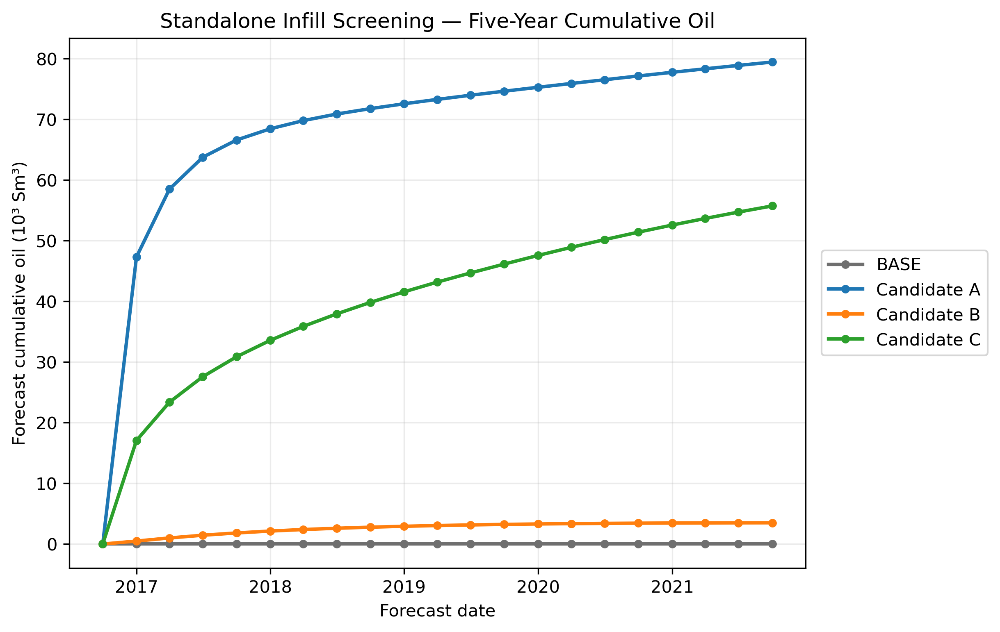

**Figure 7. Five-year cumulative oil production for the BASE and candidate cases.**

The final forecast oil volumes were:

| Candidate | Five-year oil production |
|---|---:|
| **A** | **79.47 kSm³** |
| **C** | **55.75 kSm³** |
| **B** | **3.50 kSm³** |

The resulting ranking is:


```math
\boxed{A>C\gg B}
```


Candidate A produced approximately 43% more oil than Candidate C over the five-year screening period.

Candidate B contributed very little oil relative to the other two alternatives.

The cumulative production response therefore supports the pre-forecast interpretation that Candidate A represents the most favorable of the three tested reservoir opportunities.

---

## 15.2 Oil-rate response

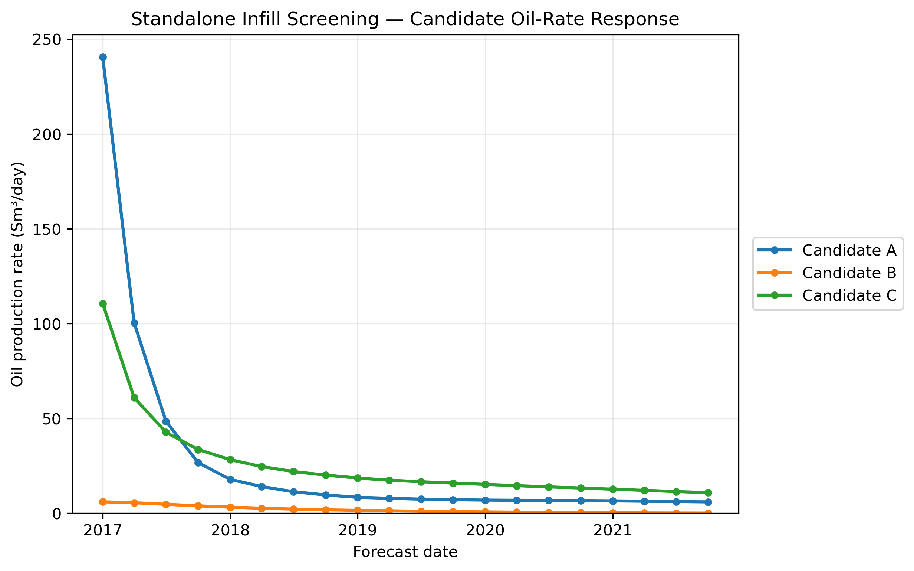

**Figure 8. Oil-production-rate response of Candidates A, B, and C.**

Peak oil rates were approximately:

| Candidate | Peak oil rate |
|---|---:|
| **A** | **240.61 Sm³/day** |
| **C** | **110.60 Sm³/day** |
| **B** | **6.03 Sm³/day** |

Candidate A exhibits the highest initial deliverability.

Candidate C provides a lower initial rate but maintains a more persistent late-time oil response.

Candidate B exhibits very limited oil deliverability throughout the forecast.

Final reported oil rates were approximately:

| Candidate | Final oil rate |
|---|---:|
| A | 5.98 Sm³/day |
| C | **10.87 Sm³/day** |
| B | 0.09 Sm³/day |

This comparison illustrates why cumulative oil production and production-rate evolution should be considered together when screening development alternatives.


---

## 15.3 Water-cut response

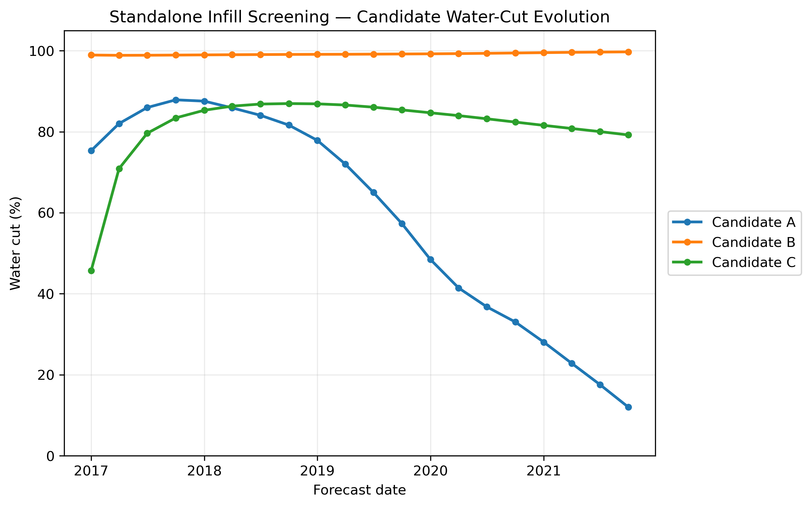

**Figure 9. Water-cut evolution during candidate production.**

The three candidates show markedly different produced-fluid behavior.

Candidate A begins with high water cut, reaches approximately 87.9%, and subsequently declines to approximately 12.0% by the end of the forecast.

Candidate B remains almost entirely water producing:


```math
f_w \approx 99\%
```


throughout the forecast.

Candidate C begins at approximately 45.7% water cut, increases to approximately 86.9%, and ends near 79.2%.

The response of Candidate B is consistent with the substantial historical water invasion identified during the pre-forecast screening.

The later reduction in Candidate A water cut is reported as observed in the well-summary data; a specific layer-scale mechanism is not assigned because connection-level production data were not retained.

---

## 15.4 Reservoir-pressure response

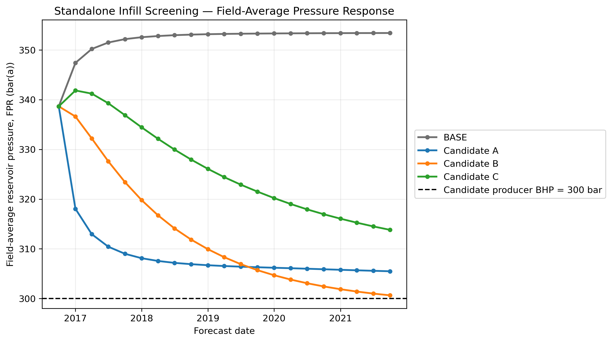

**Figure 10. Field-average reservoir-pressure response for the BASE and candidate cases.**

The dashed 300-bar line represents the imposed candidate-well bottom-hole-pressure constraint.

It should not be interpreted as local reservoir pressure at the completion.

Candidate A produces the strongest early pressure response, consistent with its higher initial deliverability.

Candidate B approaches the imposed pressure constraint while delivering very little oil and predominantly water.

The BASE case shows pressure evolution despite the absence of active forecast production or injection. This behavior is interpreted conservatively as internal model pressure redistribution/equilibration.

---

## 15.5 Integrated production comparison

The principal five-year forecast metrics are:

| Metric | Candidate A | Candidate B | Candidate C |
|---|---:|---:|---:|
| Oil production | **79.47 kSm³** | 3.50 kSm³ | 55.75 kSm³ |
| Water production | 220.11 kSm³ | **365.35 kSm³** | 188.45 kSm³ |
| Water/Oil ratio | **2.77** | **104.30** | 3.38 |
| Peak oil rate | **240.61 Sm³/day** | 6.03 Sm³/day | 110.60 Sm³/day |
| Final oil rate | 5.98 Sm³/day | 0.09 Sm³/day | **10.87 Sm³/day** |

The combined production response confirms three distinct outcomes:

**Candidate A** provides the highest cumulative oil production and strongest initial deliverability.

**Candidate C** provides meaningful oil production but a smaller total five-year contribution than Candidate A.

**Candidate B** exhibits a water-dominated production response and provides a very limited oil contribution relative to the other alternatives.

The numerical forecast therefore supports the technical ranking:


```math
\boxed{A>C\gg B}
```


---

# 16. Technical ranking and recommendation

The integrated reservoir screening and five-year forecast results provide the following technical ranking:


```math
\boxed{
1.\ \text{Candidate A}
\quad>\quad
2.\ \text{Candidate C}
\quad\gg\quad
3.\ \text{Candidate B}
}
```


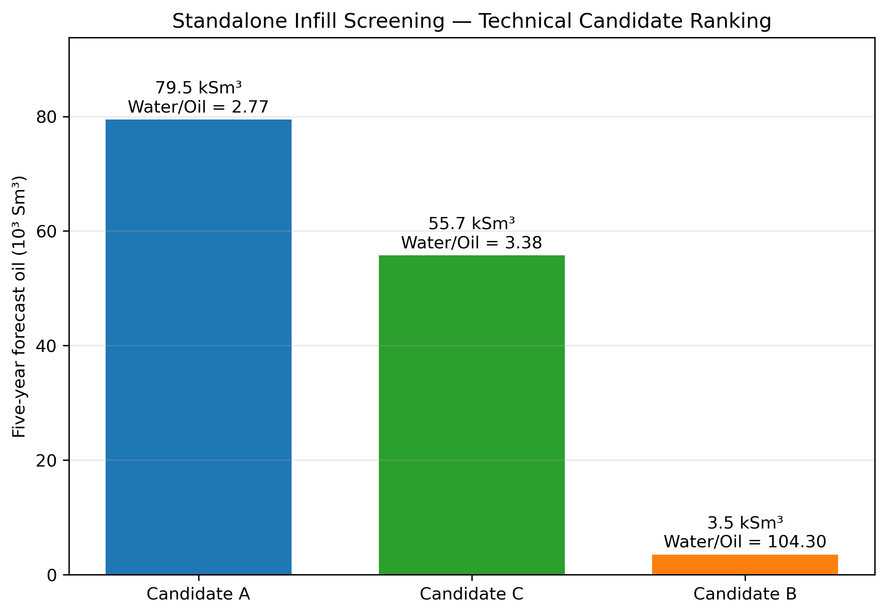

**Figure 11. Final technical ranking of the three infill-well alternatives.**

### Candidate A — preferred alternative

Candidate A provides the most favorable overall technical response among the evaluated locations.

Its performance is supported by:

- high remaining-oil saturation;
- the largest completion-scale oil-filled pore-volume screening metric;
- very high permeability;
- comparatively limited historical water invasion;
- the highest initial oil deliverability;
- the highest five-year oil production.

Candidate A is therefore recommended for **further technical evaluation** under the assumptions of this study.

### Candidate C — secondary alternative

Candidate C retains high remaining-oil saturation and produces meaningful oil during the forecast.

However, its smaller oil-filled pore-volume extent and lower permeability result in lower cumulative oil production than Candidate A.

Candidate C is therefore retained as the **secondary technical alternative**.

### Candidate B — not advanced

Candidate B exhibits substantial historical water invasion, low completion-scale oil saturation, low permeability, and a strongly water-dominated forecast response.

It is therefore **not recommended for further technical evaluation under the tested conditions**.

---

## Engineering decision

The study supports the following conclusion:

> **Candidate A is the preferred infill-well alternative among the three screened locations and should be carried forward to a more detailed technical evaluation.**

This recommendation is a reservoir-engineering screening result.

It is not a commercial drilling sanction decision.


---

# 17. Study limitations

This project is a deterministic technical screening study and should be interpreted within its defined scope.

The principal limitations are:

- a single reservoir-model realization was evaluated;
- geological and dynamic uncertainty were not propagated through an ensemble;
- historical producers and injectors remained inactive during the forecast;
- interference with an active future well system was therefore not evaluated;
- all candidates were compared using the same 300-bar BHP constraint rather than individually optimized controls;
- economic performance, drilling cost, completion cost, facilities constraints, and NPV were outside the study scope;
- some spacing comparisons were based on grid-index distance rather than physical well-to-well distance;
- connection-level production diagnostics were not retained for the candidate wells.

A field-development decision would require additional work including uncertainty assessment, optimized operating strategy, well-design evaluation, facilities constraints, and economics.

Therefore, the recommendation from this study is limited to:

> **technical prioritization of the screened reservoir opportunities for further evaluation.**

---

# 18. Learning outcomes and skills demonstrated

The main purpose of this project was to strengthen the connection between reservoir-engineering theory, realistic reservoir-model data, numerical simulation, and engineering decision-making.

The project reinforced several important lessons:

### Integrated reservoir interpretation

Remaining oil should not be evaluated from oil saturation alone.

A development opportunity must be interpreted using multiple sources of evidence, including:


```math
S_o,\quad
PV,\quad
k,\quad
P,\quad
\Delta S_w,\quad
\text{well spacing},\quad
\text{completion quality}
```


### Historical reservoir behavior matters

Historical pressure evolution and water invasion provide important context for understanding late-life development opportunities.

Candidate B demonstrated how substantial historical water invasion can translate into an unfavorable future production response.

### Completion design matters

Candidate A showed that the final completion interval can materially affect the quality of the tested opportunity.

Excluding the more water-affected K5 layer produced a more defensible K1–4 completion design.

### Numerical results require verification

The project also reinforced the importance of checking simulation and post-processing results against independent numerical evidence before using them for engineering interpretation.

### Engineering decision-making requires integration

The final ranking was not based on a single map or a single production metric.

It resulted from combining:


```math
\boxed{
\text{reservoir description}
+
\text{historical surveillance}
+
\text{candidate screening}
+
\text{forecast response}
+
\text{QA/QC}
}
```


---

## Technical skills applied

The project involved practical use of:

- reservoir surveillance and remaining-oil assessment;
- pressure and saturation interpretation;
- well-spacing and completion screening;
- black-oil reservoir simulation;
- OPM Flow;
- ECLIPSE-format reservoir models;
- ResInsight;
- Python;
- NumPy and Matplotlib;
- Linux / WSL;
- structured CSV-based result processing;
- numerical QA/QC;
- Git-based project organization;
- technical visualization and engineering communication.


---

# 19. Repository structure and reproducibility

The repository separates documentation, figures, processed results, and Python workflows into dedicated directories.

Key reproducibility files include:

- `scripts/build_forecast_cases.py` — generates the BASE and candidate forecast cases;
- `scripts/extract_final_forecast_results.py` — extracts and processes simulation results;
- `scripts/build_final_forecast_figures.py` — generates the principal forecast figures;
- `results/final_forecast_case_design.csv` — records the final candidate definitions;
- `results/final_forecast_comparison.csv` — contains the principal forecast metrics;
- `results/final_forecast_timeseries.csv` — contains the processed forecast time series.

The historical source model was retained separately from the generated forecast cases.


---

# 20. Final conclusion

This project integrated reservoir surveillance, remaining-oil assessment, well-spacing evaluation, completion screening, and numerical forecasting to evaluate three late-life Volve infill opportunities.

The five-year technical ranking was:


```math
\boxed{A>C\gg B}
```


Candidate A delivered the highest cumulative oil production and the most favorable overall technical response.

Candidate C remains a secondary development alternative.

Candidate B showed an overwhelmingly water-dominated response and is not recommended for further technical evaluation under the tested conditions.

> **Candidate A is recommended for further technical evaluation as the preferred screened infill opportunity under the deterministic assumptions evaluated in this study.**

The project demonstrates how reservoir-engineering theory, realistic reservoir-model data, numerical simulation, QA/QC, and engineering judgement can be integrated into a technically defensible development-screening workflow.
